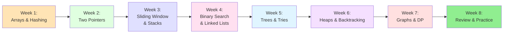
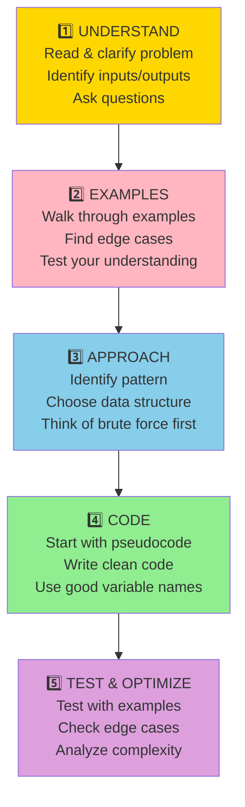
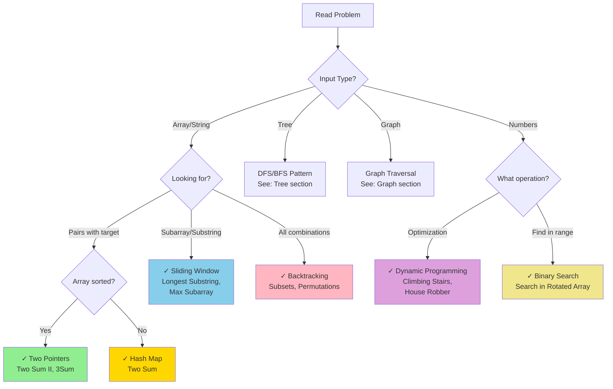
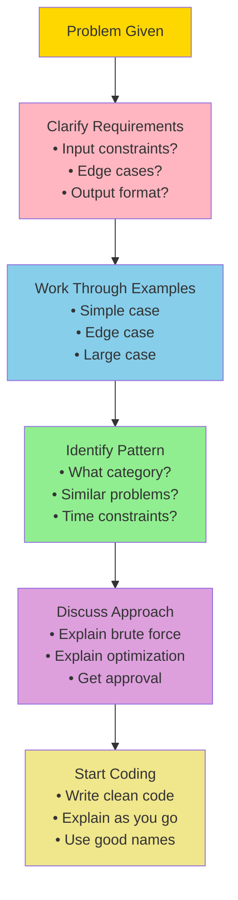

# Complete Blind 75 Problem-Solving Guide

## 🎯 What is Blind 75?

Blind 75 is a curated list of 75 LeetCode problems that cover the most important patterns and concepts for technical interviews. Master these, and you'll be well-prepared for FAANG interviews.

## 📚 How to Use This Guide

### Study Plan (8 Weeks)



## 🔥 Problem-Solving Framework

### The 5-Step Method



## 🎨 Pattern Recognition Guide

### How to Identify Which Pattern to Use



## 📖 Pattern Deep Dives

### Pattern 1: Two Pointers

**When to Use:**
- Array is sorted or can be sorted
- Looking for pairs, triplets, or specific subarrays
- Need O(1) space solution

**Common Problems:**
1. **Two Sum II** (Easy) - Sorted array, find pair
2. **3Sum** (Medium) - Find triplets that sum to zero
3. **Container With Most Water** (Medium) - Find max area
4. **Valid Palindrome** (Easy) - Check palindrome

**Template:**
```python
def two_pointers(arr):
    left, right = 0, len(arr) - 1

    while left < right:
        # Calculate something with arr[left] and arr[right]
        if condition_met:
            return result
        elif need_smaller_sum:
            right -= 1  # Move right pointer left
        else:
            left += 1   # Move left pointer right

    return default_result
```

**Visual Example - Two Sum II:**
```
Array: [2, 7, 11, 15], Target: 9

Step 1: left=0, right=3
        [2, 7, 11, 15]
         ↑          ↑
        2 + 15 = 17 > 9, move right left

Step 2: left=0, right=2
        [2, 7, 11, 15]
         ↑      ↑
        2 + 11 = 13 > 9, move right left

Step 3: left=0, right=1
        [2, 7, 11, 15]
         ↑  ↑
        2 + 7 = 9 ✓ Found!
```

### Pattern 2: Sliding Window

**When to Use:**
- Need to find contiguous subarray/substring
- Keywords: "longest", "shortest", "maximum", "minimum"
- Want to optimize from O(n²) to O(n)

**Common Problems:**
1. **Longest Substring Without Repeating Characters** (Medium)
2. **Minimum Window Substring** (Hard)
3. **Best Time to Buy and Sell Stock** (Easy)

**Template:**
```python
def sliding_window(arr):
    left = 0
    window_data = {}  # Track window state
    result = 0

    for right in range(len(arr)):
        # Expand window: add arr[right]
        window_data[arr[right]] = window_data.get(arr[right], 0) + 1

        # Shrink window while invalid
        while not is_valid(window_data):
            window_data[arr[left]] -= 1
            left += 1

        # Update result
        result = max(result, right - left + 1)

    return result
```

**Visual Example - Longest Substring:**
```
String: "abcabcbb"

Window: [a] - unique: 1
Window: [ab] - unique: 2
Window: [abc] - unique: 3 ✓ best so far
Window: [abca] - 'a' repeats! Shrink
Window: [bca] - unique: 3
Window: [cab] - unique: 3
...continues
```

### Pattern 3: Fast & Slow Pointers

**When to Use:**
- Linked list problems
- Detect cycles
- Find middle element
- Find kth from end

**Common Problems:**
1. **Linked List Cycle** (Easy)
2. **Middle of Linked List** (Easy)
3. **Happy Number** (Easy)

**Template:**
```python
def fast_slow(head):
    slow = fast = head

    while fast and fast.next:
        slow = slow.next        # Move 1 step
        fast = fast.next.next   # Move 2 steps

        if slow == fast:
            return True  # Cycle detected

    return False  # No cycle
```

### Pattern 4: Binary Search

**When to Use:**
- Array is sorted or rotated sorted
- Need O(log n) solution
- Search for element or boundary

**Common Problems:**
1. **Binary Search** (Easy)
2. **Search in Rotated Sorted Array** (Medium)
3. **Find Minimum in Rotated Sorted Array** (Medium)

**Template:**
```python
def binary_search(arr, target):
    left, right = 0, len(arr) - 1

    while left <= right:
        mid = left + (right - left) // 2

        if arr[mid] == target:
            return mid
        elif arr[mid] < target:
            left = mid + 1
        else:
            right = mid - 1

    return -1
```

### Pattern 5: Backtracking

**When to Use:**
- Need to find ALL solutions
- Generate combinations, permutations, subsets
- Keywords: "find all", "generate all"

**Common Problems:**
1. **Subsets** (Medium)
2. **Permutations** (Medium)
3. **Combination Sum** (Medium)

**Template:**
```python
def backtrack(arr):
    result = []

    def dfs(path, start):
        # Base case - add current path to result
        result.append(path[:])

        # Try all possibilities
        for i in range(start, len(arr)):
            # Choose
            path.append(arr[i])
            # Explore
            dfs(path, i + 1)
            # Unchoose (backtrack)
            path.pop()

    dfs([], 0)
    return result
```

### Pattern 6: Dynamic Programming

**When to Use:**
- Optimization problems (min/max/longest/shortest)
- Count number of ways
- Has overlapping subproblems
- Has optimal substructure

**Common Problems:**
1. **Climbing Stairs** (Easy)
2. **House Robber** (Medium)
3. **Longest Increasing Subsequence** (Medium)
4. **Coin Change** (Medium)

**5-Step DP Framework:**
```
1. Define the state
   - What does dp[i] represent?

2. Find the recurrence relation
   - How does dp[i] relate to previous states?

3. Initialize base cases
   - What are dp[0], dp[1]?

4. Determine iteration order
   - Forward or backward?

5. Return the answer
   - Usually dp[n] or max(dp)
```

**Template:**
```python
def dp_bottom_up(n):
    # Step 1 & 3: Initialize
    dp = [0] * (n + 1)
    dp[0] = base_case_0
    dp[1] = base_case_1

    # Step 4: Fill table
    for i in range(2, n + 1):
        # Step 2: Recurrence relation
        dp[i] = dp[i-1] + dp[i-2]  # Example: Fibonacci

    # Step 5: Return answer
    return dp[n]
```

## 🎯 Complete Blind 75 Checklist

### Arrays & Hashing (9 problems)

| Problem | Difficulty | Pattern | Key Concept |
|---------|-----------|---------|-------------|
| Two Sum | Easy | Hash Map | Store complement |
| Best Time to Buy and Sell Stock | Easy | One Pass | Track min, max profit |
| Contains Duplicate | Easy | Hash Set | Check existence |
| Product of Array Except Self | Medium | Prefix/Suffix | Two passes |
| Maximum Subarray | Easy | Kadane's Algorithm | Dynamic Programming |
| Maximum Product Subarray | Medium | Track min/max | Handle negatives |
| Find Minimum in Rotated Sorted Array | Medium | Binary Search | Find pivot |
| Search in Rotated Sorted Array | Medium | Modified Binary Search | Check which half sorted |
| 3Sum | Medium | Two Pointers | Sort + avoid duplicates |

**Pro Tip:** For array problems, always consider:
1. Can I use hash map for O(1) lookup?
2. Is array sorted? Can I use two pointers or binary search?
3. Can I solve in one pass?
4. What if I use prefix/suffix arrays?

### Linked Lists (6 problems)

| Problem | Difficulty | Pattern | Key Concept |
|---------|-----------|---------|-------------|
| Reverse Linked List | Easy | Iterative/Recursive | Three pointers |
| Detect Cycle | Easy | Fast & Slow | Floyd's algorithm |
| Merge Two Sorted Lists | Easy | Two Pointers | Compare & merge |
| Merge K Sorted Lists | Hard | Heap/Divide & Conquer | Priority queue |
| Remove Nth Node From End | Medium | Two Pass/One Pass | Gap of n |
| Reorder List | Medium | Find Middle + Reverse | Combine techniques |

**Pro Tip:** For linked lists:
1. Draw it out! Visual helps a lot
2. Consider dummy node for edge cases
3. Fast & slow pointers for middle/cycle
4. Remember to handle NULL cases

### Trees (11 problems)

| Problem | Difficulty | Pattern | Key Concept |
|---------|-----------|---------|-------------|
| Maximum Depth | Easy | DFS/BFS | Recursion |
| Same Tree | Easy | DFS | Compare both |
| Invert Binary Tree | Easy | DFS | Swap children |
| Binary Tree Level Order | Medium | BFS | Use queue |
| Validate BST | Medium | DFS | Track min/max |
| Kth Smallest in BST | Medium | Inorder Traversal | Sorted order |
| Lowest Common Ancestor | Medium | DFS | Path finding |
| Construct Tree from Preorder & Inorder | Medium | Recursion | Find root pattern |
| Binary Tree Maximum Path Sum | Hard | DFS | Return vs update |
| Serialize/Deserialize | Hard | BFS/DFS | String encoding |
| Subtree of Another Tree | Easy | DFS | Match trees |

**Pro Tip:** For trees:
1. DFS = recursion or stack
2. BFS = queue (level order)
3. For BST, use inorder for sorted
4. Draw small examples first

### Dynamic Programming (12 problems)

| Problem | Difficulty | Pattern | Key Concept |
|---------|-----------|---------|-------------|
| Climbing Stairs | Easy | 1D DP | Fibonacci |
| Coin Change | Medium | 1D DP | Min coins |
| Longest Increasing Subsequence | Medium | 1D DP | Track best ending here |
| Longest Common Subsequence | Medium | 2D DP | Match characters |
| Word Break | Medium | 1D DP | Dictionary lookup |
| Combination Sum IV | Medium | 1D DP | Order matters |
| House Robber | Medium | 1D DP | Max with constraint |
| House Robber II | Medium | 1D DP | Circular array |
| Decode Ways | Medium | 1D DP | Count combinations |
| Unique Paths | Medium | 2D DP | Grid paths |
| Jump Game | Medium | Greedy/DP | Reachability |

**Pro Tip:** For DP:
1. Start with brute force recursion
2. Add memoization (top-down)
3. Convert to tabulation (bottom-up)
4. Optimize space if possible

## 🚀 Interview Day Strategy

### Before Coding



### Time Management (45 minutes)

- **5 min:** Understand problem & clarify
- **5 min:** Work through examples
- **5 min:** Identify pattern & discuss approach
- **20 min:** Code the solution
- **5 min:** Test with examples
- **5 min:** Discuss optimizations & edge cases

### Communication Tips

**DO:**
- Think out loud
- Explain your approach before coding
- Ask clarifying questions
- Test your code with examples
- Discuss trade-offs

**DON'T:**
- Jump straight to coding
- Stay silent
- Ignore edge cases
- Give up easily
- Argue with interviewer

## 🔧 Common Pitfalls & How to Avoid

### Pitfall 1: Not Understanding the Problem
**Solution:** Rephrase problem in your own words, work through examples

### Pitfall 2: Jumping to Code Too Fast
**Solution:** Discuss approach first, get approval before coding

### Pitfall 3: Ignoring Edge Cases
**Solution:** Always test: empty input, single element, all same values

### Pitfall 4: Not Testing Code
**Solution:** Walk through your code with examples, even simple ones

### Pitfall 5: Poor Time Management
**Solution:** If stuck >5 min, ask for hint or try simpler approach

## 📚 Additional Resources

### Practice Schedule

**Week 1-2:** Easy problems only
**Week 3-4:** Mix of easy and medium
**Week 5-6:** Medium problems focus
**Week 7-8:** Mix of medium and hard + review

### Daily Routine

1. **Morning (1 hour):**
   - Review patterns and templates
   - Solve 1-2 easy problems

2. **Evening (1-2 hours):**
   - Solve 1-2 medium/hard problems
   - Review solutions, note patterns

3. **Weekend:**
   - Mock interviews
   - Review weak areas
   - Solve challenging problems

## 🎓 Mastery Checklist

- [ ] Can identify pattern within 2 minutes
- [ ] Know all templates by heart
- [ ] Can code optimal solution in 15-20 minutes
- [ ] Can explain time & space complexity
- [ ] Can handle follow-up questions
- [ ] Comfortable with all data structures
- [ ] Can optimize brute force solutions
- [ ] Know common edge cases for each pattern

## 💡 Final Tips

1. **Consistency > Intensity:** 2 hours daily beats 14 hours on weekend
2. **Quality > Quantity:** Understand 1 problem deeply beats solving 5 superficially
3. **Patterns > Problems:** Learn patterns, problems become variations
4. **Mock Interviews:** Practice under pressure, get feedback
5. **Review Mistakes:** Your best learning comes from wrong attempts

Remember: Everyone struggles at first. Keep practicing, and patterns will become second nature!
