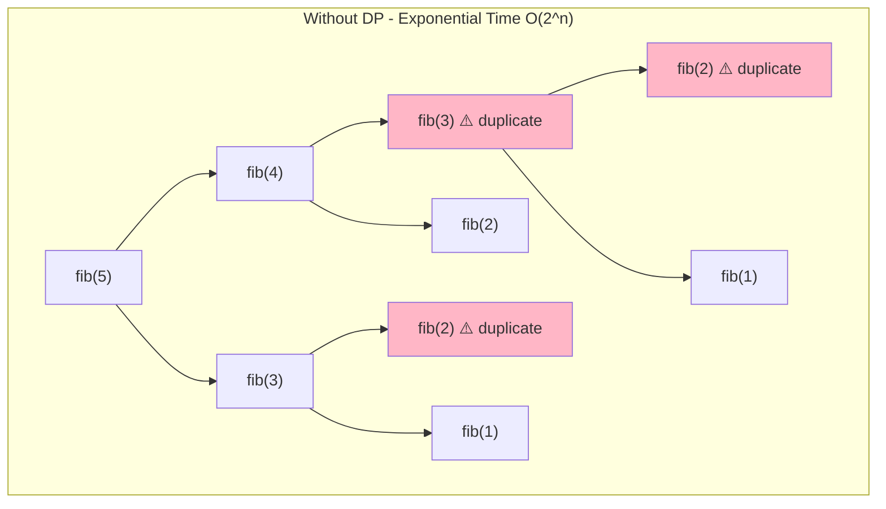
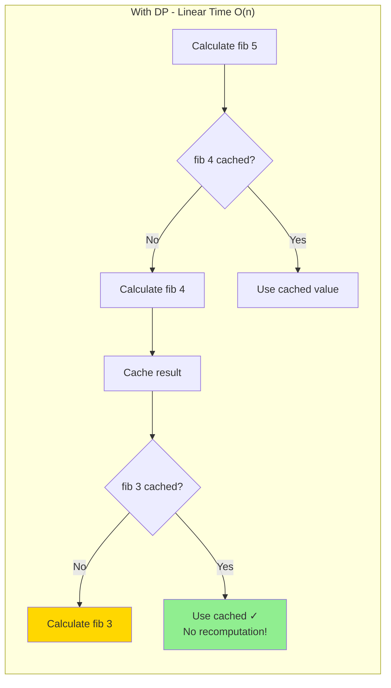
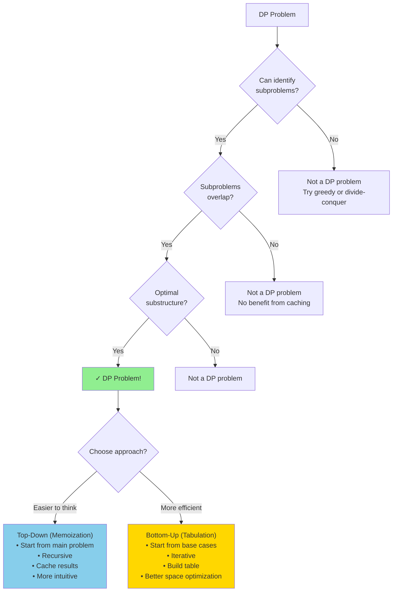
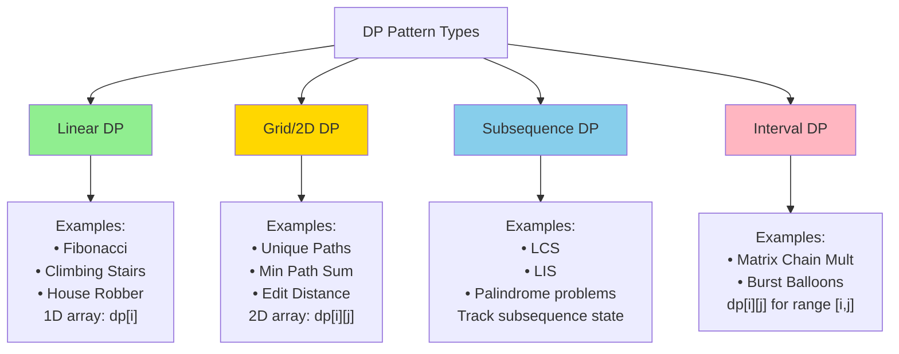
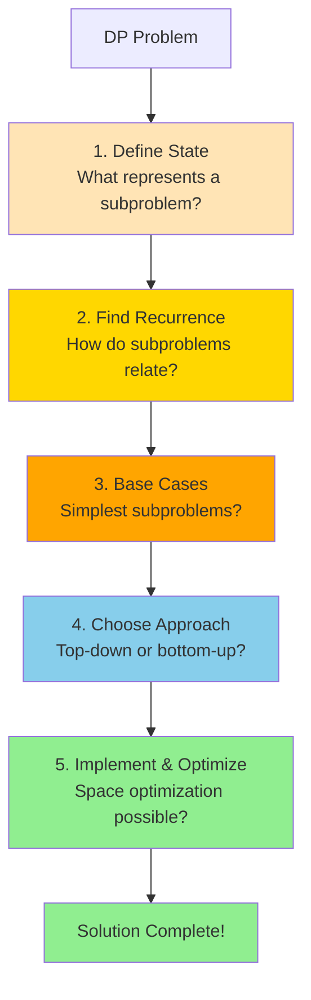
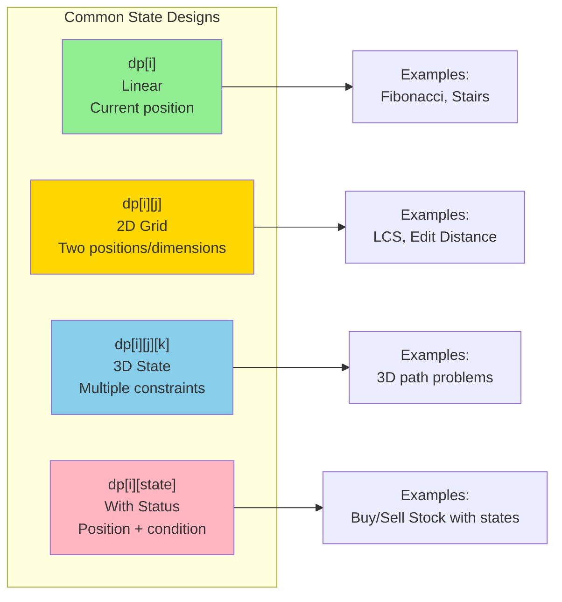
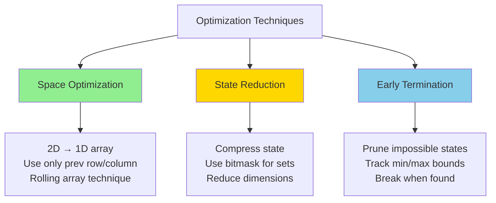
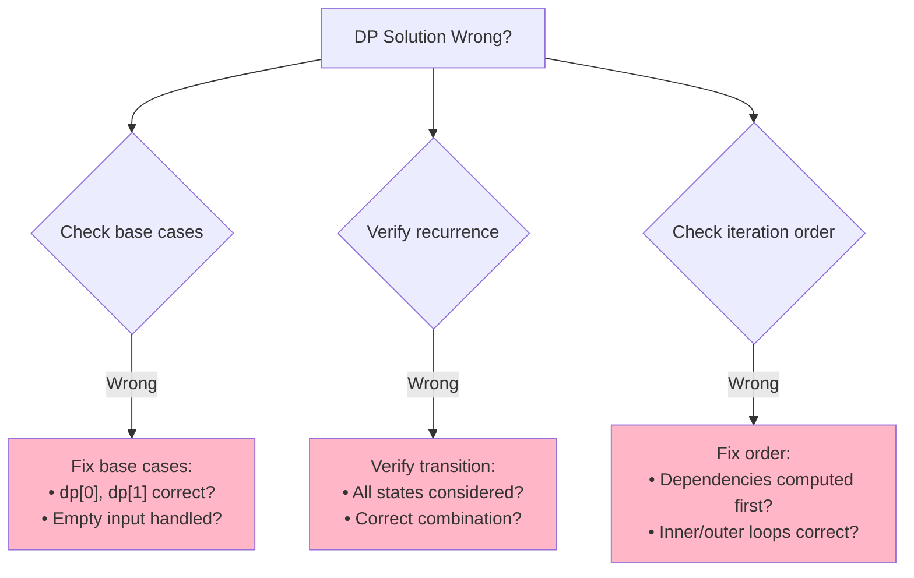
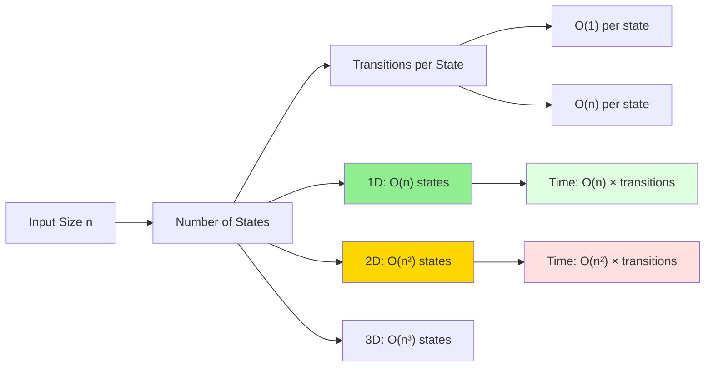

# Dynamic Programming

Dynamic Programming (DP) is a powerful technique used to solve complex problems by breaking them down into simpler overlapping subproblems. It's particularly useful for optimization problems where we need to find the best solution among many possible solutions.

## Key Characteristics of Dynamic Programming Problems

1. **Overlapping Subproblems**: The same subproblems are solved multiple times.
2. **Optimal Substructure**: The optimal solution to the problem can be constructed from optimal solutions of its subproblems.

## Approaches to Dynamic Programming

### 1. Top-Down Approach (Memoization)

- Start with the original problem
- Break it down into subproblems
- Solve each subproblem recursively
- Store the results of subproblems to avoid redundant calculations
- Use the stored results when the same subproblem occurs again

### 2. Bottom-Up Approach (Tabulation)

- Start with the smallest subproblems
- Solve them first and store their results
- Build up to larger subproblems using the results of smaller ones
- Eventually solve the original problem

## Visual Representation

### Fibonacci Without DP vs With DP





### DP Approach Decision Tree



### Common DP Patterns Visual



Consider the Fibonacci sequence calculation:

## Common Dynamic Programming Problems

### 1. Fibonacci Sequence

**Problem**: Find the nth Fibonacci number, where F(0) = 0, F(1) = 1, and F(n) = F(n-1) + F(n-2) for n > 1.

#### Top-Down Approach (Memoization)

**Python:**
```python
def fibonacci_memoization(n, memo={}):
    if n in memo:
        return memo[n]
    if n <= 1:
        return n
    
    memo[n] = fibonacci_memoization(n-1, memo) + fibonacci_memoization(n-2, memo)
    return memo[n]

# Example
print(fibonacci_memoization(10))  # Output: 55
```

**JavaScript:**
```javascript
function fibonacciMemoization(n, memo = {}) {
    if (n in memo) {
        return memo[n];
    }
    if (n <= 1) {
        return n;
    }
    
    memo[n] = fibonacciMemoization(n-1, memo) + fibonacciMemoization(n-2, memo);
    return memo[n];
}

// Example
console.log(fibonacciMemoization(10));  // Output: 55
```

#### Bottom-Up Approach (Tabulation)

**Python:**
```python
def fibonacci_tabulation(n):
    if n <= 1:
        return n
    
    dp = [0] * (n + 1)
    dp[1] = 1
    
    for i in range(2, n + 1):
        dp[i] = dp[i-1] + dp[i-2]
    
    return dp[n]

# Example
print(fibonacci_tabulation(10))  # Output: 55
```

**JavaScript:**
```javascript
function fibonacciTabulation(n) {
    if (n <= 1) {
        return n;
    }
    
    const dp = Array(n + 1).fill(0);
    dp[1] = 1;
    
    for (let i = 2; i <= n; i++) {
        dp[i] = dp[i-1] + dp[i-2];
    }
    
    return dp[n];
}

// Example
console.log(fibonacciTabulation(10));  // Output: 55
```

### 2. Longest Common Subsequence (LCS)

**Problem**: Find the length of the longest subsequence present in both given strings.

**Python:**
```python
def longest_common_subsequence(text1, text2):
    m, n = len(text1), len(text2)
    dp = [[0] * (n + 1) for _ in range(m + 1)]
    
    for i in range(1, m + 1):
        for j in range(1, n + 1):
            if text1[i-1] == text2[j-1]:
                dp[i][j] = dp[i-1][j-1] + 1
            else:
                dp[i][j] = max(dp[i-1][j], dp[i][j-1])
    
    return dp[m][n]

# Example
print(longest_common_subsequence("abcde", "ace"))  # Output: 3 (The LCS is "ace")
```

**JavaScript:**
```javascript
function longestCommonSubsequence(text1, text2) {
    const m = text1.length;
    const n = text2.length;
    const dp = Array(m + 1).fill().map(() => Array(n + 1).fill(0));
    
    for (let i = 1; i <= m; i++) {
        for (let j = 1; j <= n; j++) {
            if (text1[i-1] === text2[j-1]) {
                dp[i][j] = dp[i-1][j-1] + 1;
            } else {
                dp[i][j] = Math.max(dp[i-1][j], dp[i][j-1]);
            }
        }
    }
    
    return dp[m][n];
}

// Example
console.log(longestCommonSubsequence("abcde", "ace"));  // Output: 3 (The LCS is "ace")
```

### 3. Knapsack Problem

**Problem**: Given weights and values of n items, put these items in a knapsack of capacity W to get the maximum total value.

**Python:**
```python
def knapsack(weights, values, capacity):
    n = len(weights)
    dp = [[0] * (capacity + 1) for _ in range(n + 1)]
    
    for i in range(1, n + 1):
        for w in range(1, capacity + 1):
            if weights[i-1] <= w:
                dp[i][w] = max(values[i-1] + dp[i-1][w-weights[i-1]], dp[i-1][w])
            else:
                dp[i][w] = dp[i-1][w]
    
    return dp[n][capacity]

# Example
weights = [10, 20, 30]
values = [60, 100, 120]
capacity = 50
print(knapsack(weights, values, capacity))  # Output: 220
```

**JavaScript:**
```javascript
function knapsack(weights, values, capacity) {
    const n = weights.length;
    const dp = Array(n + 1).fill().map(() => Array(capacity + 1).fill(0));
    
    for (let i = 1; i <= n; i++) {
        for (let w = 1; w <= capacity; w++) {
            if (weights[i-1] <= w) {
                dp[i][w] = Math.max(values[i-1] + dp[i-1][w-weights[i-1]], dp[i-1][w]);
            } else {
                dp[i][w] = dp[i-1][w];
            }
        }
    }
    
    return dp[n][capacity];
}

// Example
const weights = [10, 20, 30];
const values = [60, 100, 120];
const capacity = 50;
console.log(knapsack(weights, values, capacity));  // Output: 220
```

### 4. Coin Change Problem

**Problem**: Given a set of coin denominations and a target amount, find the minimum number of coins needed to make up that amount.

**Python:**
```python
def coin_change(coins, amount):
    dp = [float('inf')] * (amount + 1)
    dp[0] = 0
    
    for coin in coins:
        for i in range(coin, amount + 1):
            dp[i] = min(dp[i], dp[i - coin] + 1)
    
    return dp[amount] if dp[amount] != float('inf') else -1

# Example
coins = [1, 2, 5]
amount = 11
print(coin_change(coins, amount))  # Output: 3 (5 + 5 + 1)
```

**JavaScript:**
```javascript
function coinChange(coins, amount) {
    const dp = Array(amount + 1).fill(Infinity);
    dp[0] = 0;
    
    for (const coin of coins) {
        for (let i = coin; i <= amount; i++) {
            dp[i] = Math.min(dp[i], dp[i - coin] + 1);
        }
    }
    
    return dp[amount] === Infinity ? -1 : dp[amount];
}

// Example
const coins = [1, 2, 5];
const amount = 11;
console.log(coinChange(coins, amount));  // Output: 3 (5 + 5 + 1)
```

### 5. Longest Increasing Subsequence (LIS)

**Problem**: Find the length of the longest subsequence of a given sequence such that all elements of the subsequence are sorted in increasing order.

**Python:**
```python
def longest_increasing_subsequence(nums):
    if not nums:
        return 0
    
    n = len(nums)
    dp = [1] * n
    
    for i in range(1, n):
        for j in range(i):
            if nums[i] > nums[j]:
                dp[i] = max(dp[i], dp[j] + 1)
    
    return max(dp)

# Example
nums = [10, 9, 2, 5, 3, 7, 101, 18]
print(longest_increasing_subsequence(nums))  # Output: 4 (The LIS is [2, 3, 7, 101])
```

**JavaScript:**
```javascript
function longestIncreasingSubsequence(nums) {
    if (nums.length === 0) {
        return 0;
    }
    
    const n = nums.length;
    const dp = Array(n).fill(1);
    
    for (let i = 1; i < n; i++) {
        for (let j = 0; j < i; j++) {
            if (nums[i] > nums[j]) {
                dp[i] = Math.max(dp[i], dp[j] + 1);
            }
        }
    }
    
    return Math.max(...dp);
}

// Example
const nums = [10, 9, 2, 5, 3, 7, 101, 18];
console.log(longestIncreasingSubsequence(nums));  // Output: 4 (The LIS is [2, 3, 7, 101])
```

## How to Approach Dynamic Programming Problems

1. **Identify if it's a DP problem**:
   - Does it ask for optimization (min/max/longest/shortest)?
   - Can the problem be broken down into overlapping subproblems?
   - Does it have optimal substructure?

2. **Define the state**:
   - What information do we need to represent a subproblem?
   - For example, dp[i] might represent the solution for the first i elements.

3. **Establish the recurrence relation**:
   - How can we build the solution to a larger problem from solutions to smaller problems?
   - This is the heart of the DP approach.

4. **Identify the base cases**:
   - What are the simplest subproblems that we can solve directly?

5. **Decide on the approach**:
   - Top-down (memoization) or bottom-up (tabulation)?
   - Top-down is often easier to implement but may have stack overflow issues for large inputs.
   - Bottom-up is usually more efficient but can be harder to conceptualize.

6. **Optimize space complexity (if needed)**:
   - Can we reduce the dimensions of our DP array?
   - For example, if dp[i] only depends on dp[i-1] and dp[i-2], we might only need to store the last two values.

## Common DP Patterns

1. **1D Array DP**:
   - Problems where the state depends on previous states in a single dimension.
   - Examples: Fibonacci, Climbing Stairs, House Robber.

2. **2D Array DP**:
   - Problems where the state depends on previous states in two dimensions.
   - Examples: Longest Common Subsequence, Edit Distance, Knapsack.

3. **Grid-based DP**:
   - Problems involving movement in a 2D grid.
   - Examples: Unique Paths, Minimum Path Sum.

4. **Interval DP**:
   - Problems involving intervals or subarrays.
   - Examples: Matrix Chain Multiplication, Palindrome Partitioning.

5. **State Compression DP**:
   - Problems where states can be represented using bits.
   - Examples: Traveling Salesman Problem, Subset Sum.

## Tips and Tricks

1. **Draw out the recurrence relation**:
   - Visualize how smaller subproblems contribute to larger ones.

2. **Use a table to trace through the algorithm**:
   - Fill in the DP table by hand for a small example to understand the pattern.

3. **Consider space optimization**:
   - Many DP problems can be solved with O(n) or even O(1) space instead of O(n²).

4. **Watch out for initialization**:
   - Incorrect base cases or initialization can lead to wrong results.

5. **Be careful with the order of iteration**:
   - In bottom-up DP, you need to ensure that all dependencies are computed before they're needed.

## Common Pitfalls

1. **Incorrect state definition**:
   - Not capturing all the information needed to solve the subproblem.

2. **Wrong recurrence relation**:
   - Misunderstanding how subproblems relate to each other.

3. **Missing base cases**:
   - Not handling the simplest cases correctly.

4. **Off-by-one errors**:
   - Especially common in problems involving strings or arrays.

5. **Inefficient implementation**:
   - Using recursion without memoization, leading to exponential time complexity.

## How to Identify DP Problems

Look for these clues in the problem statement:

1. The problem asks for optimization (maximum/minimum/longest/shortest).
2. The solution involves making choices at each step, and these choices affect future options.
3. The problem can be broken down into smaller, similar subproblems.
4. There are overlapping subproblems (the same subproblem is solved multiple times).
5. Keywords like "count the number of ways," "find the minimum/maximum," or "is it possible to achieve."

## 💡 Advanced Tips and Tricks

### DP Problem-Solving Framework



### State Design Patterns



### Pro Tips for Interviews

**1. Start with Recursion, Add Memoization**
```python
# Step 1: Write recursive solution
def solve_recursive(n):
    if n <= 1:
        return n
    return solve_recursive(n-1) + solve_recursive(n-2)

# Step 2: Add memoization (convert to DP)
def solve_dp(n, memo={}):
    if n in memo:
        return memo[n]
    if n <= 1:
        return n
    memo[n] = solve_dp(n-1, memo) + solve_dp(n-2, memo)
    return memo[n]
```

**2. Identify the State Transition**
```python
# General pattern for 1D DP
dp[i] = function(dp[i-1], dp[i-2], ..., dp[0])

# Example: Climbing Stairs
# Can reach step i from (i-1) or (i-2)
dp[i] = dp[i-1] + dp[i-2]
```

**3. Space Optimization Technique**
```python
# Original: O(n) space
dp = [0] * (n+1)
for i in range(n+1):
    dp[i] = calculate(dp)

# Optimized: O(1) space (when only last few states matter)
prev2, prev1 = 0, 1
for i in range(2, n+1):
    curr = prev1 + prev2
    prev2, prev1 = prev1, curr
```

**4. Template for Top-Down DP**
```python
def dp_top_down(params, memo={}):
    # Check memo
    key = make_key(params)
    if key in memo:
        return memo[key]

    # Base case
    if is_base_case(params):
        return base_value

    # Recursive case
    result = combine(
        dp_top_down(subproblem1, memo),
        dp_top_down(subproblem2, memo)
    )

    # Store and return
    memo[key] = result
    return result
```

**5. Template for Bottom-Up DP**
```python
def dp_bottom_up(n):
    # Initialize DP table
    dp = [0] * (n+1)

    # Base cases
    dp[0] = base_value_0
    dp[1] = base_value_1

    # Fill table
    for i in range(2, n+1):
        dp[i] = combine(dp[i-1], dp[i-2])

    return dp[n]
```

### Common DP Optimizations



### Debugging DP Solutions



### Interview Strategy

**1. Recognize DP Signals:**
- "Find all ways to..."
- "Count number of solutions..."
- "Find optimal (min/max/longest/shortest)..."
- "Is it possible to..."
- Making sequential decisions with constraints

**2. Problem-Solving Steps:**
1. Identify if it's DP (overlapping subproblems + optimal substructure)
2. Define state clearly
3. Write recurrence relation
4. Identify base cases
5. Implement (top-down first, usually easier)
6. Optimize space if possible

**3. Time vs Space Trade-off:**
| Approach | Time | Space | Use When |
|----------|------|-------|----------|
| Recursion | O(2^n) | O(n) stack | Never in production! |
| Top-Down | O(n) | O(n) memo + O(n) stack | Easier to code, less optimal |
| Bottom-Up | O(n) | O(n) table | More optimal, production code |
| Space-Optimized | O(n) | O(1) | When space is critical |

**4. Common Mistakes to Avoid:**

| Mistake | Problem | Fix |
|---------|---------|-----|
| Wrong state definition | Incomplete information | Add necessary parameters to state |
| Incorrect base case | Wrong results for simple inputs | Test with smallest inputs |
| Missing states in recurrence | Not considering all transitions | Draw state diagram |
| Wrong iteration order | Using uncomputed values | Check dependencies |
| Not initializing DP table | Garbage values | Initialize with 0, -1, or infinity |

### Complexity Analysis Quick Reference



**Time Complexity Formula:**
```
Time = (Number of States) × (Time per State)
```

**Space Complexity:**
- Top-Down: O(number of states) + O(recursion depth)
- Bottom-Up: O(number of states) or optimized to O(k) where k is constant

### Real Interview Tips

1. **Talk through your thought process:** Explain how you identify it's DP
2. **Draw examples:** Visualize small cases to find pattern
3. **Start simple:** Get brute force working, then optimize
4. **Consider edge cases:** Empty input, single element, all same values
5. **Optimize later:** First make it work, then make it fast 