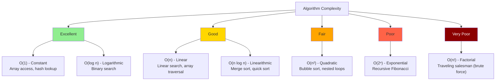
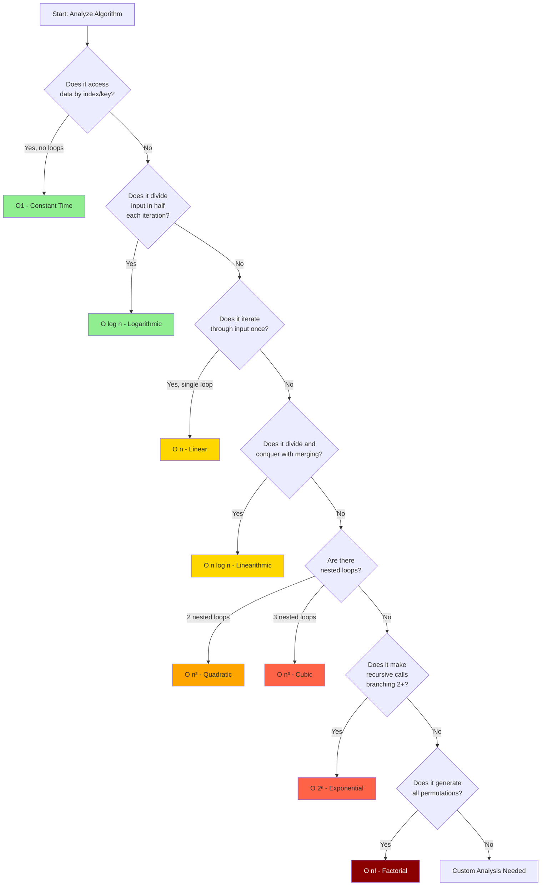

# Big O Notation

Big O Notation is a mathematical notation that describes the limiting behavior of a function when the argument tends towards a particular value or infinity. In computer science, it's used to classify algorithms according to how their run time or space requirements grow as the input size grows.

## Common Time Complexities

| Notation | Name | Description | Example |
|----------|------|-------------|---------|
| O(1) | Constant | Runtime is independent of input size | Accessing an array element by index |
| O(log n) | Logarithmic | Runtime grows logarithmically with input size | Binary search |
| O(n) | Linear | Runtime grows linearly with input size | Linear search |
| O(n log n) | Linearithmic | Runtime grows by n log n | Efficient sorting algorithms (Merge sort, Heap sort) |
| O(n²) | Quadratic | Runtime grows quadratically with input size | Simple sorting algorithms (Bubble sort, Insertion sort) |
| O(n³) | Cubic | Runtime grows cubically with input size | Simple matrix multiplication |
| O(2ⁿ) | Exponential | Runtime doubles with each addition to the input | Recursive calculation of Fibonacci numbers |
| O(n!) | Factorial | Runtime grows factorially with input size | Brute force solution to the traveling salesman problem |

## Visual Representation

### Complexity Growth Comparison



### Complexity Decision Tree

When analyzing an algorithm, use this decision tree to determine its time complexity:



### Growth Rate Visualization

As input size grows, here's how different complexities scale:

| n | O(1) | O(log n) | O(n) | O(n log n) | O(n²) | O(2ⁿ) |
|---|------|----------|------|------------|-------|-------|
| 1 | 1 | 0 | 1 | 0 | 1 | 2 |
| 10 | 1 | 3 | 10 | 30 | 100 | 1,024 |
| 100 | 1 | 7 | 100 | 700 | 10,000 | 1.27×10³⁰ |
| 1,000 | 1 | 10 | 1,000 | 10,000 | 1,000,000 | ∞ |
| 10,000 | 1 | 13 | 10,000 | 130,000 | 100,000,000 | ∞ |

## Examples in Python and JavaScript

### O(1) - Constant Time

**Python:**
```python
def get_first_element(arr):
    return arr[0] if arr else None
```

**JavaScript:**
```javascript
function getFirstElement(arr) {
    return arr.length > 0 ? arr[0] : null;
}
```

### O(log n) - Logarithmic Time

**Python:**
```python
def binary_search(arr, target):
    left, right = 0, len(arr) - 1
    
    while left <= right:
        mid = (left + right) // 2
        if arr[mid] == target:
            return mid
        elif arr[mid] < target:
            left = mid + 1
        else:
            right = mid - 1
            
    return -1
```

**JavaScript:**
```javascript
function binarySearch(arr, target) {
    let left = 0;
    let right = arr.length - 1;
    
    while (left <= right) {
        const mid = Math.floor((left + right) / 2);
        if (arr[mid] === target) {
            return mid;
        } else if (arr[mid] < target) {
            left = mid + 1;
        } else {
            right = mid - 1;
        }
    }
    
    return -1;
}
```

### O(n) - Linear Time

**Python:**
```python
def find_max(arr):
    if not arr:
        return None
    
    max_val = arr[0]
    for num in arr:
        if num > max_val:
            max_val = num
    
    return max_val
```

**JavaScript:**
```javascript
function findMax(arr) {
    if (arr.length === 0) {
        return null;
    }
    
    let maxVal = arr[0];
    for (let i = 1; i < arr.length; i++) {
        if (arr[i] > maxVal) {
            maxVal = arr[i];
        }
    }
    
    return maxVal;
}
```

### O(n²) - Quadratic Time

**Python:**
```python
def bubble_sort(arr):
    n = len(arr)
    for i in range(n):
        for j in range(0, n - i - 1):
            if arr[j] > arr[j + 1]:
                arr[j], arr[j + 1] = arr[j + 1], arr[j]
    return arr
```

**JavaScript:**
```javascript
function bubbleSort(arr) {
    const n = arr.length;
    for (let i = 0; i < n; i++) {
        for (let j = 0; j < n - i - 1; j++) {
            if (arr[j] > arr[j + 1]) {
                [arr[j], arr[j + 1]] = [arr[j + 1], arr[j]];
            }
        }
    }
    return arr;
}
```

## Space Complexity

Space complexity refers to the amount of memory an algorithm uses relative to the input size.

| Notation | Description | Example |
|----------|-------------|---------|
| O(1) | Constant space | Variables that don't depend on input size |
| O(n) | Linear space | Arrays or objects that grow with input size |
| O(n²) | Quadratic space | 2D arrays that grow with input size |

## Tips for Optimizing Complexity

1. **Avoid nested loops when possible** - They often lead to O(n²) time complexity
2. **Use appropriate data structures** - Hash tables can reduce search time from O(n) to O(1)
3. **Consider divide and conquer approaches** - They can reduce complexity from O(n) to O(log n)
4. **Be mindful of recursive calls** - They can lead to O(2ⁿ) complexity if not optimized
5. **Use dynamic programming** - It can optimize recursive solutions with overlapping subproblems
6. **Analyze both time and space complexity** - Sometimes you can trade one for the other

## How to Calculate Big O

1. **Identify the basic operations** - Find the operations that are executed most frequently
2. **Count the number of operations** - Determine how many times each operation is executed
3. **Express in terms of input size** - Relate the operation count to the input size
4. **Drop constants and lower-order terms** - Focus on the dominant term as input size grows
5. **Use the worst-case scenario** - Consider the maximum number of operations that could be required 