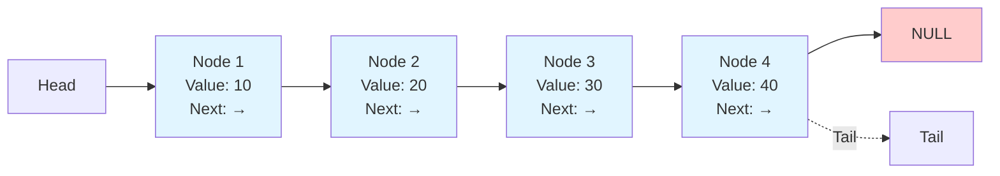
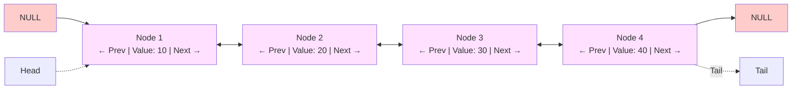
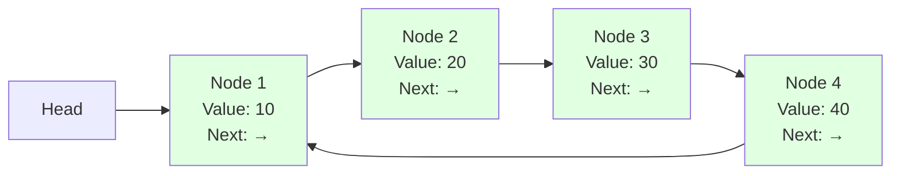
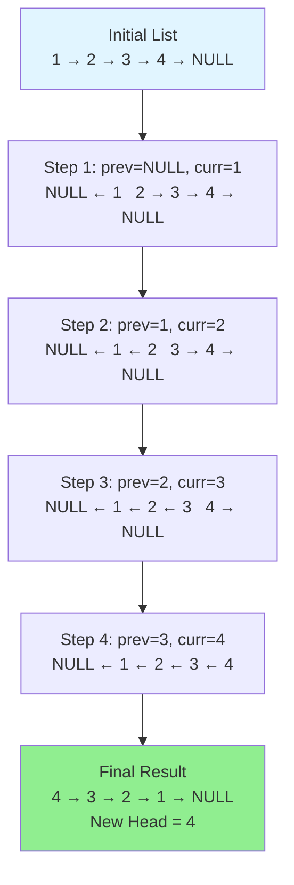
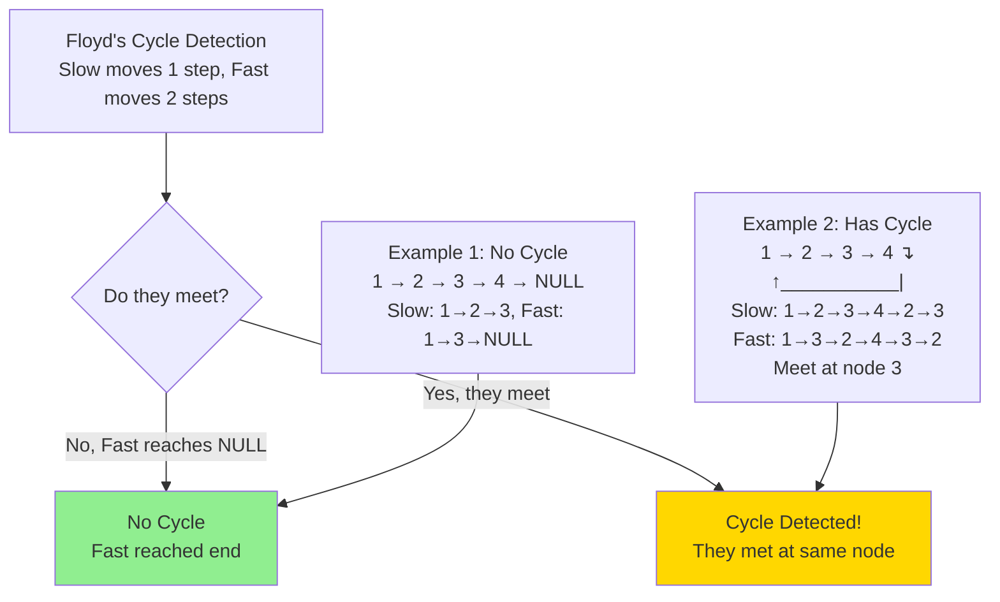

# Linked Lists

A linked list is a linear data structure where elements are stored in nodes, and each node points to the next node in the sequence. Unlike arrays, linked lists don't require contiguous memory allocation.

## Visual Representation

### Singly Linked List Structure



### Doubly Linked List Structure



### Circular Linked List Structure



## Types of Linked Lists

1. **Singly Linked List**: Each node has a value and a pointer to the next node.
2. **Doubly Linked List**: Each node has a value, a pointer to the next node, and a pointer to the previous node.
3. **Circular Linked List**: The last node points back to the first node, forming a circle.

## Implementation in Python and JavaScript

### Python

#### Singly Linked List

```python
class Node:
    def __init__(self, value):
        self.value = value
        self.next = None

class SinglyLinkedList:
    def __init__(self):
        self.head = None
        self.tail = None
        self.length = 0
    
    def append(self, value):
        new_node = Node(value)
        if not self.head:
            self.head = new_node
            self.tail = new_node
        else:
            self.tail.next = new_node
            self.tail = new_node
        self.length += 1
        return self
    
    def prepend(self, value):
        new_node = Node(value)
        if not self.head:
            self.head = new_node
            self.tail = new_node
        else:
            new_node.next = self.head
            self.head = new_node
        self.length += 1
        return self
    
    def insert(self, index, value):
        if index < 0 or index > self.length:
            return False
        if index == 0:
            return self.prepend(value)
        if index == self.length:
            return self.append(value)
        
        new_node = Node(value)
        prev_node = self._traverse_to_index(index - 1)
        new_node.next = prev_node.next
        prev_node.next = new_node
        self.length += 1
        return True
    
    def remove(self, index):
        if index < 0 or index >= self.length:
            return None
        if index == 0:
            removed_node = self.head
            self.head = self.head.next
            if self.length == 1:
                self.tail = None
            self.length -= 1
            return removed_node.value
        
        prev_node = self._traverse_to_index(index - 1)
        removed_node = prev_node.next
        prev_node.next = removed_node.next
        if index == self.length - 1:
            self.tail = prev_node
        self.length -= 1
        return removed_node.value
    
    def _traverse_to_index(self, index):
        current_node = self.head
        count = 0
        while count != index:
            current_node = current_node.next
            count += 1
        return current_node
    
    def print_list(self):
        values = []
        current_node = self.head
        while current_node:
            values.append(current_node.value)
            current_node = current_node.next
        return values

# Example usage
linked_list = SinglyLinkedList()
linked_list.append(10)
linked_list.append(20)
linked_list.prepend(5)
linked_list.insert(2, 15)
print(linked_list.print_list())  # Output: [5, 10, 15, 20]
linked_list.remove(2)
print(linked_list.print_list())  # Output: [5, 10, 20]
```

#### Doubly Linked List

```python
class Node:
    def __init__(self, value):
        self.value = value
        self.next = None
        self.prev = None

class DoublyLinkedList:
    def __init__(self):
        self.head = None
        self.tail = None
        self.length = 0
    
    def append(self, value):
        new_node = Node(value)
        if not self.head:
            self.head = new_node
            self.tail = new_node
        else:
            self.tail.next = new_node
            new_node.prev = self.tail
            self.tail = new_node
        self.length += 1
        return self
    
    def prepend(self, value):
        new_node = Node(value)
        if not self.head:
            self.head = new_node
            self.tail = new_node
        else:
            new_node.next = self.head
            self.head.prev = new_node
            self.head = new_node
        self.length += 1
        return self
    
    def insert(self, index, value):
        if index < 0 or index > self.length:
            return False
        if index == 0:
            return self.prepend(value)
        if index == self.length:
            return self.append(value)
        
        new_node = Node(value)
        leader = self._traverse_to_index(index - 1)
        follower = leader.next
        
        leader.next = new_node
        new_node.prev = leader
        new_node.next = follower
        follower.prev = new_node
        
        self.length += 1
        return True
    
    def remove(self, index):
        if index < 0 or index >= self.length:
            return None
        if index == 0:
            removed_node = self.head
            self.head = self.head.next
            if self.head:
                self.head.prev = None
            else:
                self.tail = None
            self.length -= 1
            return removed_node.value
        if index == self.length - 1:
            removed_node = self.tail
            self.tail = self.tail.prev
            self.tail.next = None
            self.length -= 1
            return removed_node.value
        
        current_node = self._traverse_to_index(index)
        current_node.prev.next = current_node.next
        current_node.next.prev = current_node.prev
        self.length -= 1
        return current_node.value
    
    def _traverse_to_index(self, index):
        # Optimize traversal by starting from the closest end
        if index < self.length / 2:
            current_node = self.head
            count = 0
            while count != index:
                current_node = current_node.next
                count += 1
        else:
            current_node = self.tail
            count = self.length - 1
            while count != index:
                current_node = current_node.prev
                count -= 1
        return current_node
    
    def print_list(self):
        values = []
        current_node = self.head
        while current_node:
            values.append(current_node.value)
            current_node = current_node.next
        return values

# Example usage
doubly_linked_list = DoublyLinkedList()
doubly_linked_list.append(10)
doubly_linked_list.append(20)
doubly_linked_list.prepend(5)
doubly_linked_list.insert(2, 15)
print(doubly_linked_list.print_list())  # Output: [5, 10, 15, 20]
doubly_linked_list.remove(2)
print(doubly_linked_list.print_list())  # Output: [5, 10, 20]
```

### JavaScript

#### Singly Linked List

```javascript
class Node {
    constructor(value) {
        this.value = value;
        this.next = null;
    }
}

class SinglyLinkedList {
    constructor() {
        this.head = null;
        this.tail = null;
        this.length = 0;
    }
    
    append(value) {
        const newNode = new Node(value);
        if (!this.head) {
            this.head = newNode;
            this.tail = newNode;
        } else {
            this.tail.next = newNode;
            this.tail = newNode;
        }
        this.length++;
        return this;
    }
    
    prepend(value) {
        const newNode = new Node(value);
        if (!this.head) {
            this.head = newNode;
            this.tail = newNode;
        } else {
            newNode.next = this.head;
            this.head = newNode;
        }
        this.length++;
        return this;
    }
    
    insert(index, value) {
        if (index < 0 || index > this.length) {
            return false;
        }
        if (index === 0) {
            return !!this.prepend(value);
        }
        if (index === this.length) {
            return !!this.append(value);
        }
        
        const newNode = new Node(value);
        const prevNode = this._traverseToIndex(index - 1);
        newNode.next = prevNode.next;
        prevNode.next = newNode;
        this.length++;
        return true;
    }
    
    remove(index) {
        if (index < 0 || index >= this.length) {
            return null;
        }
        if (index === 0) {
            const removedNode = this.head;
            this.head = this.head.next;
            if (this.length === 1) {
                this.tail = null;
            }
            this.length--;
            return removedNode.value;
        }
        
        const prevNode = this._traverseToIndex(index - 1);
        const removedNode = prevNode.next;
        prevNode.next = removedNode.next;
        if (index === this.length - 1) {
            this.tail = prevNode;
        }
        this.length--;
        return removedNode.value;
    }
    
    _traverseToIndex(index) {
        let currentNode = this.head;
        let count = 0;
        while (count !== index) {
            currentNode = currentNode.next;
            count++;
        }
        return currentNode;
    }
    
    printList() {
        const values = [];
        let currentNode = this.head;
        while (currentNode) {
            values.push(currentNode.value);
            currentNode = currentNode.next;
        }
        return values;
    }
}

// Example usage
const linkedList = new SinglyLinkedList();
linkedList.append(10);
linkedList.append(20);
linkedList.prepend(5);
linkedList.insert(2, 15);
console.log(linkedList.printList());  // Output: [5, 10, 15, 20]
linkedList.remove(2);
console.log(linkedList.printList());  // Output: [5, 10, 20]
```

#### Doubly Linked List

```javascript
class Node {
    constructor(value) {
        this.value = value;
        this.next = null;
        this.prev = null;
    }
}

class DoublyLinkedList {
    constructor() {
        this.head = null;
        this.tail = null;
        this.length = 0;
    }
    
    append(value) {
        const newNode = new Node(value);
        if (!this.head) {
            this.head = newNode;
            this.tail = newNode;
        } else {
            this.tail.next = newNode;
            newNode.prev = this.tail;
            this.tail = newNode;
        }
        this.length++;
        return this;
    }
    
    prepend(value) {
        const newNode = new Node(value);
        if (!this.head) {
            this.head = newNode;
            this.tail = newNode;
        } else {
            newNode.next = this.head;
            this.head.prev = newNode;
            this.head = newNode;
        }
        this.length++;
        return this;
    }
    
    insert(index, value) {
        if (index < 0 || index > this.length) {
            return false;
        }
        if (index === 0) {
            return !!this.prepend(value);
        }
        if (index === this.length) {
            return !!this.append(value);
        }
        
        const newNode = new Node(value);
        const leader = this._traverseToIndex(index - 1);
        const follower = leader.next;
        
        leader.next = newNode;
        newNode.prev = leader;
        newNode.next = follower;
        follower.prev = newNode;
        
        this.length++;
        return true;
    }
    
    remove(index) {
        if (index < 0 || index >= this.length) {
            return null;
        }
        if (index === 0) {
            const removedNode = this.head;
            this.head = this.head.next;
            if (this.head) {
                this.head.prev = null;
            } else {
                this.tail = null;
            }
            this.length--;
            return removedNode.value;
        }
        if (index === this.length - 1) {
            const removedNode = this.tail;
            this.tail = this.tail.prev;
            this.tail.next = null;
            this.length--;
            return removedNode.value;
        }
        
        const currentNode = this._traverseToIndex(index);
        currentNode.prev.next = currentNode.next;
        currentNode.next.prev = currentNode.prev;
        this.length--;
        return currentNode.value;
    }
    
    _traverseToIndex(index) {
        // Optimize traversal by starting from the closest end
        if (index < this.length / 2) {
            let currentNode = this.head;
            let count = 0;
            while (count !== index) {
                currentNode = currentNode.next;
                count++;
            }
            return currentNode;
        } else {
            let currentNode = this.tail;
            let count = this.length - 1;
            while (count !== index) {
                currentNode = currentNode.prev;
                count--;
            }
            return currentNode;
        }
    }
    
    printList() {
        const values = [];
        let currentNode = this.head;
        while (currentNode) {
            values.push(currentNode.value);
            currentNode = currentNode.next;
        }
        return values;
    }
}

// Example usage
const doublyLinkedList = new DoublyLinkedList();
doublyLinkedList.append(10);
doublyLinkedList.append(20);
doublyLinkedList.prepend(5);
doublyLinkedList.insert(2, 15);
console.log(doublyLinkedList.printList());  // Output: [5, 10, 15, 20]
doublyLinkedList.remove(2);
console.log(doublyLinkedList.printList());  // Output: [5, 10, 20]
```

## Common Operations and Their Time Complexity

| Operation | Singly Linked List | Doubly Linked List |
|-----------|-------------------|-------------------|
| Access | O(n) | O(n) |
| Search | O(n) | O(n) |
| Insertion (at beginning) | O(1) | O(1) |
| Insertion (at end) | O(1) with tail pointer | O(1) |
| Insertion (in middle) | O(n) | O(n) |
| Deletion (at beginning) | O(1) | O(1) |
| Deletion (at end) | O(n) without tail pointer, O(1) with tail pointer | O(1) |
| Deletion (in middle) | O(n) | O(n) |

## Common Linked List Algorithms

### 1. Reverse a Linked List

#### Visual Step-by-Step Reversal



**Python:**
```python
def reverse_linked_list(head):
    prev = None
    current = head
    
    while current:
        next_temp = current.next  # Store next node
        current.next = prev       # Reverse the pointer
        prev = current            # Move prev to current
        current = next_temp       # Move current to next
    
    return prev  # New head

# Example usage
# Assuming we have a linked list: 1 -> 2 -> 3 -> 4 -> None
# After reversal: 4 -> 3 -> 2 -> 1 -> None
```

**JavaScript:**
```javascript
function reverseLinkedList(head) {
    let prev = null;
    let current = head;
    
    while (current) {
        const nextTemp = current.next;  // Store next node
        current.next = prev;            // Reverse the pointer
        prev = current;                 // Move prev to current
        current = nextTemp;             // Move current to next
    }
    
    return prev;  // New head
}

// Example usage
// Assuming we have a linked list: 1 -> 2 -> 3 -> 4 -> null
// After reversal: 4 -> 3 -> 2 -> 1 -> null
```

### 2. Detect a Cycle in a Linked List

#### Floyd's Cycle Detection (Tortoise and Hare)



**Python:**
```python
def has_cycle(head):
    if not head or not head.next:
        return False
    
    slow = head
    fast = head
    
    while fast and fast.next:
        slow = slow.next          # Move slow pointer by 1
        fast = fast.next.next     # Move fast pointer by 2
        
        if slow == fast:          # If they meet, there's a cycle
            return True
    
    return False  # If fast reaches the end, no cycle

# Example usage
# Cycle: 1 -> 2 -> 3 -> 4 -> 2 (points back to 2)
# Result: True
```

**JavaScript:**
```javascript
function hasCycle(head) {
    if (!head || !head.next) {
        return false;
    }
    
    let slow = head;
    let fast = head;
    
    while (fast && fast.next) {
        slow = slow.next;         // Move slow pointer by 1
        fast = fast.next.next;    // Move fast pointer by 2
        
        if (slow === fast) {      // If they meet, there's a cycle
            return true;
        }
    }
    
    return false;  // If fast reaches the end, no cycle
}

// Example usage
// Cycle: 1 -> 2 -> 3 -> 4 -> 2 (points back to 2)
// Result: true
```

### 3. Find the Middle of a Linked List

**Python:**
```python
def find_middle(head):
    if not head:
        return None
    
    slow = head
    fast = head
    
    while fast and fast.next:
        slow = slow.next          # Move slow pointer by 1
        fast = fast.next.next     # Move fast pointer by 2
    
    return slow  # When fast reaches the end, slow is at the middle

# Example usage
# List: 1 -> 2 -> 3 -> 4 -> 5
# Middle: 3
```

**JavaScript:**
```javascript
function findMiddle(head) {
    if (!head) {
        return null;
    }
    
    let slow = head;
    let fast = head;
    
    while (fast && fast.next) {
        slow = slow.next;         // Move slow pointer by 1
        fast = fast.next.next;    // Move fast pointer by 2
    }
    
    return slow;  // When fast reaches the end, slow is at the middle
}

// Example usage
// List: 1 -> 2 -> 3 -> 4 -> 5
// Middle: 3
```

### 4. Merge Two Sorted Linked Lists

**Python:**
```python
def merge_two_lists(l1, l2):
    dummy = Node(0)  # Dummy node to simplify edge cases
    current = dummy
    
    while l1 and l2:
        if l1.value < l2.value:
            current.next = l1
            l1 = l1.next
        else:
            current.next = l2
            l2 = l2.next
        current = current.next
    
    # Attach remaining nodes
    if l1:
        current.next = l1
    else:
        current.next = l2
    
    return dummy.next  # Skip the dummy node

# Example usage
# List1: 1 -> 3 -> 5
# List2: 2 -> 4 -> 6
# Merged: 1 -> 2 -> 3 -> 4 -> 5 -> 6
```

**JavaScript:**
```javascript
function mergeTwoLists(l1, l2) {
    const dummy = new Node(0);  // Dummy node to simplify edge cases
    let current = dummy;
    
    while (l1 && l2) {
        if (l1.value < l2.value) {
            current.next = l1;
            l1 = l1.next;
        } else {
            current.next = l2;
            l2 = l2.next;
        }
        current = current.next;
    }
    
    // Attach remaining nodes
    if (l1) {
        current.next = l1;
    } else {
        current.next = l2;
    }
    
    return dummy.next;  // Skip the dummy node
}

// Example usage
// List1: 1 -> 3 -> 5
// List2: 2 -> 4 -> 6
// Merged: 1 -> 2 -> 3 -> 4 -> 5 -> 6
```

## Advantages of Linked Lists

1. **Dynamic Size**: Linked lists can grow or shrink during execution.
2. **Efficient Insertions/Deletions**: Constant time insertions and deletions at the beginning (and end with a tail pointer).
3. **No Wasted Memory**: Linked lists allocate memory as needed.
4. **Implementation of Other Data Structures**: Used to implement stacks, queues, and other abstract data types.

## Disadvantages of Linked Lists

1. **Random Access**: No direct access to elements by index (O(n) time).
2. **Extra Memory**: Requires extra memory for pointers.
3. **Cache Performance**: Poor cache locality compared to arrays.
4. **Traversal**: Always requires O(n) time to traverse the entire list.

## When to Use Linked Lists

- When you need constant-time insertions/deletions from the beginning (and end if using a tail pointer).
- When you don't know how many items will be in the list ahead of time.
- When you don't need random access to elements.
- When you want to insert items in the middle of the list frequently.

## Common Linked List Problems from Blind 75 and Grind 75

1. **Reverse Linked List** (Easy): Reverse a singly linked list.
2. **Detect Cycle** (Easy): Determine if a linked list has a cycle.
3. **Merge Two Sorted Lists** (Easy): Merge two sorted linked lists into one sorted list.
4. **Remove Nth Node From End** (Medium): Remove the nth node from the end of a linked list.
5. **Reorder List** (Medium): Reorder a linked list to L₀ → Lₙ → L₁ → Lₙ₋₁ → L₂ → Lₙ₋₂ → ...
6. **Intersection of Two Linked Lists** (Easy): Find the node where two linked lists intersect.
7. **Linked List Cycle II** (Medium): Find the node where the cycle begins in a linked list.
8. **Palindrome Linked List** (Easy): Determine if a linked list is a palindrome.

## How to Identify Linked List Problems

Look for these clues in the problem statement:

1. The problem explicitly mentions a linked list data structure.
2. The problem involves traversing a sequence of connected nodes.
3. The problem requires manipulating pointers or references.
4. The problem involves detecting cycles or finding intersections.
5. The problem requires merging or splitting sequences.
6. Keywords like "node," "next," "pointer," or "reference." 