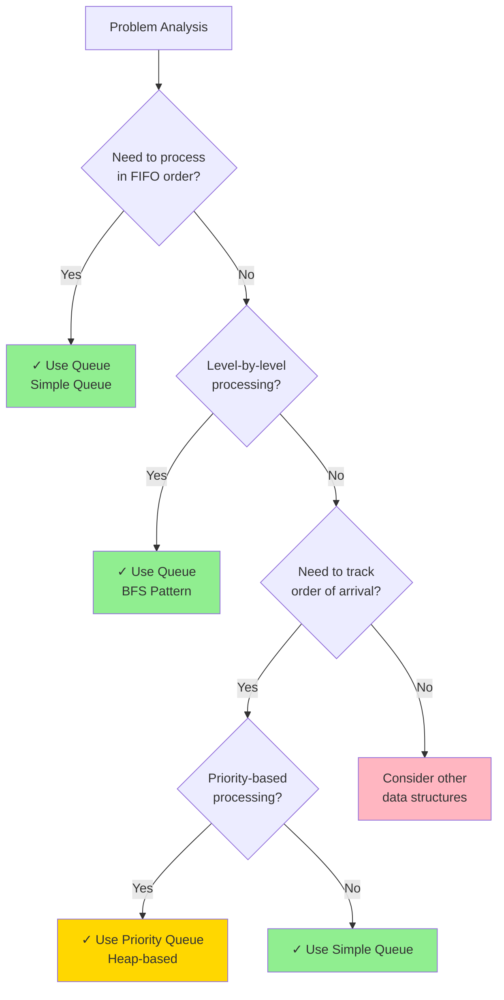
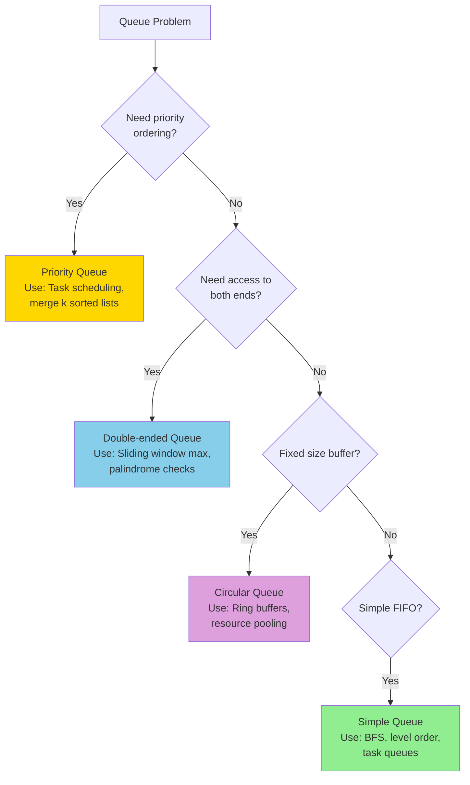
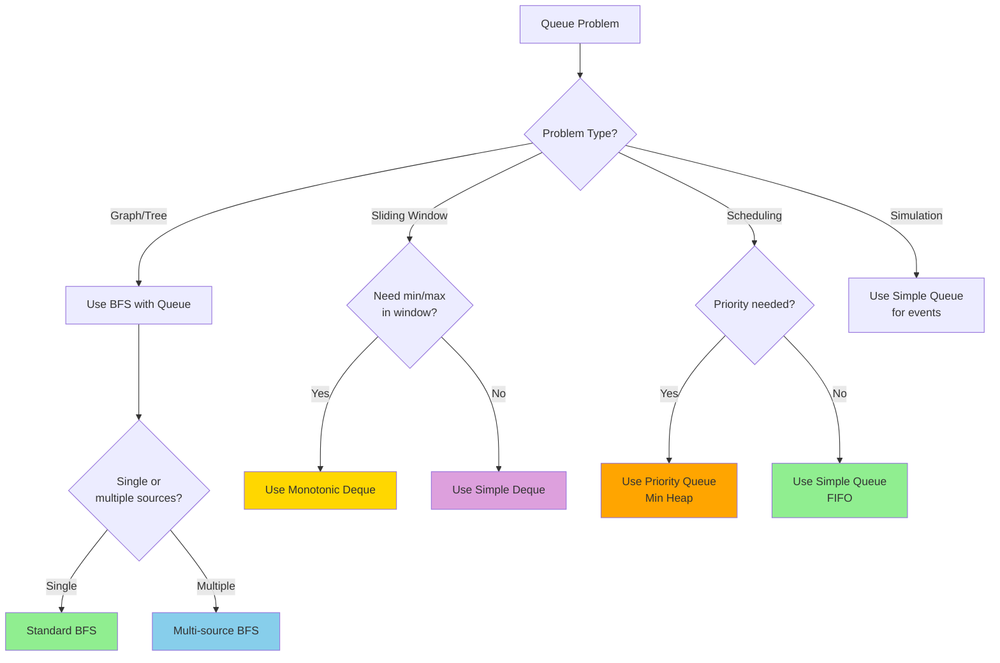

# Queues

A queue is a linear data structure that follows the First In, First Out (FIFO) principle. Elements are added at the rear (enqueue) and removed from the front (dequeue).

## Visual Representation

```
  Front                     Rear
   ↓                         ↓
┌────┐   ┌────┐   ┌────┐   ┌────┐
│ 10 │ → │ 20 │ → │ 30 │ → │ 40 │
└────┘   └────┘   └────┘   └────┘
  Dequeue                  Enqueue
```

## Key Operations

1. **Enqueue**: Add an element to the rear of the queue
2. **Dequeue**: Remove an element from the front of the queue
3. **Front/Peek**: View the front element without removing it
4. **isEmpty**: Check if the queue is empty
5. **Size**: Get the number of elements in the queue

## How to Approach Queue Problems

### Step 1: Identify if a Queue is Needed



### Step 2: Choose the Right Queue Type



### Step 3: Common Queue Problem Patterns

#### Pattern 1: Level-Order Traversal (BFS)

```
Problem indicators:
- Process tree/graph level by level
- Find shortest path in unweighted graph
- Explore all neighbors before going deeper

Approach:
1. Initialize queue with starting node
2. Mark starting node as visited
3. While queue not empty:
   - Dequeue front element
   - Process current element
   - Enqueue all unvisited neighbors
   - Mark neighbors as visited

Template:
queue = [start_node]
visited = {start_node}

while queue:
    current = queue.pop(0)
    process(current)

    for neighbor in get_neighbors(current):
        if neighbor not in visited:
            visited.add(neighbor)
            queue.append(neighbor)
```

#### Pattern 2: Sliding Window with Queue

```
Problem indicators:
- Find max/min in sliding windows
- Track elements in a range
- Need to maintain order

Approach:
1. Use deque to store indices or values
2. Maintain deque in sorted order (increasing or decreasing)
3. Remove elements outside current window
4. Front of deque always has answer

Template:
from collections import deque

dq = deque()
result = []

for i in range(len(arr)):
    # Remove elements outside window
    while dq and dq[0] < i - k + 1:
        dq.popleft()

    # Maintain order (e.g., decreasing for max)
    while dq and arr[dq[-1]] < arr[i]:
        dq.pop()

    dq.append(i)

    # Add result when window is complete
    if i >= k - 1:
        result.append(arr[dq[0]])
```

#### Pattern 3: Multi-Source BFS

```
Problem indicators:
- Multiple starting points
- Need minimum distance from any source
- Simultaneous expansion

Approach:
1. Initialize queue with ALL sources
2. Process all sources simultaneously
3. Track distance/level for each cell
4. Stop when target found or queue empty

Template:
queue = deque()
visited = set()

# Add all sources to queue
for source in sources:
    queue.append((source, 0))  # (node, distance)
    visited.add(source)

while queue:
    node, dist = queue.popleft()

    if is_target(node):
        return dist

    for neighbor in get_neighbors(node):
        if neighbor not in visited:
            visited.add(neighbor)
            queue.append((neighbor, dist + 1))
```

#### Pattern 4: Priority Queue for Scheduling

```
Problem indicators:
- Process tasks by priority
- Merge multiple sorted sequences
- Always need min/max element

Approach:
1. Use heapq (priority queue)
2. Push elements with priority
3. Always pop minimum priority element
4. Re-insert if needed

Template:
import heapq

pq = []

# Add tasks with priority
for task in tasks:
    heapq.heappush(pq, (priority, task))

# Process in priority order
while pq:
    priority, task = heapq.heappop(pq)
    process(task)

    # Re-insert if needed
    if needs_rescheduling(task):
        heapq.heappush(pq, (new_priority, task))
```

### Step 4: Problem-Solving Decision Tree



### Step 5: When to Use Which Queue

| Scenario | Queue Type | Why | Example Problems |
|----------|-----------|-----|-----------------|
| BFS traversal | Simple Queue | FIFO order | Binary tree level order |
| Task scheduling | Priority Queue | Order by priority | CPU scheduling, Merge k sorted |
| Sliding window max/min | Deque | Access both ends | Max in sliding window |
| Fixed-size buffer | Circular Queue | Memory efficiency | Stream processing |
| Need to remove from both ends | Deque | Flexibility | Palindrome check |
| Process events in order | Simple Queue | Sequential processing | Print queue |

### Step 6: Common Mistakes to Avoid

```
1. USING WRONG QUEUE TYPE
   ⚠ Using list.pop(0) instead of deque.popleft() in Python
   ✓ Always use collections.deque for efficient O(1) operations

2. FORGETTING TO MARK AS VISITED IN BFS
   ⚠ This causes infinite loops or revisiting nodes
   ✓ Always maintain a visited set

3. PROCESSING QUEUE INCORRECTLY IN LEVEL-ORDER
   ⚠ Not tracking level boundaries properly
   ✓ Store level size before processing each level

4. NOT HANDLING EMPTY QUEUE
   ⚠ Trying to dequeue from empty queue
   ✓ Always check if queue is empty before dequeueing

5. PRIORITY QUEUE DIRECTION CONFUSION
   ⚠ Python's heapq is min-heap by default
   ✓ Negate values for max-heap behavior
```

## Implementation in Python and JavaScript

### Python

#### Using a List

```python
class Queue:
    def __init__(self):
        self.items = []
    
    def enqueue(self, item):
        self.items.append(item)
    
    def dequeue(self):
        if not self.is_empty():
            return self.items.pop(0)  # O(n) operation
        return None
    
    def front(self):
        if not self.is_empty():
            return self.items[0]
        return None
    
    def is_empty(self):
        return len(self.items) == 0
    
    def size(self):
        return len(self.items)

# Example usage
queue = Queue()
queue.enqueue(10)
queue.enqueue(20)
queue.enqueue(30)
print(queue.front())    # Output: 10
print(queue.dequeue())  # Output: 10
print(queue.dequeue())  # Output: 20
print(queue.size())     # Output: 1
```

#### Using collections.deque (Efficient)

```python
from collections import deque

class Queue:
    def __init__(self):
        self.items = deque()
    
    def enqueue(self, item):
        self.items.append(item)
    
    def dequeue(self):
        if not self.is_empty():
            return self.items.popleft()  # O(1) operation
        return None
    
    def front(self):
        if not self.is_empty():
            return self.items[0]
        return None
    
    def is_empty(self):
        return len(self.items) == 0
    
    def size(self):
        return len(self.items)

# Example usage
queue = Queue()
queue.enqueue(10)
queue.enqueue(20)
queue.enqueue(30)
print(queue.front())    # Output: 10
print(queue.dequeue())  # Output: 10
print(queue.dequeue())  # Output: 20
print(queue.size())     # Output: 1
```

#### Using a Linked List

```python
class Node:
    def __init__(self, value):
        self.value = value
        self.next = None

class Queue:
    def __init__(self):
        self.front = None
        self.rear = None
        self.length = 0
    
    def enqueue(self, value):
        new_node = Node(value)
        if self.is_empty():
            self.front = new_node
            self.rear = new_node
        else:
            self.rear.next = new_node
            self.rear = new_node
        self.length += 1
    
    def dequeue(self):
        if self.is_empty():
            return None
        
        temp = self.front
        if self.front == self.rear:
            self.rear = None
        
        self.front = self.front.next
        self.length -= 1
        return temp.value
    
    def front_value(self):
        if self.is_empty():
            return None
        return self.front.value
    
    def is_empty(self):
        return self.length == 0
    
    def size(self):
        return self.length

# Example usage
queue = Queue()
queue.enqueue(10)
queue.enqueue(20)
queue.enqueue(30)
print(queue.front_value())  # Output: 10
print(queue.dequeue())      # Output: 10
print(queue.dequeue())      # Output: 20
print(queue.size())         # Output: 1
```

### JavaScript

#### Using an Array

```javascript
class Queue {
    constructor() {
        this.items = [];
    }
    
    enqueue(item) {
        this.items.push(item);
    }
    
    dequeue() {
        if (!this.isEmpty()) {
            return this.items.shift();  // O(n) operation
        }
        return null;
    }
    
    front() {
        if (!this.isEmpty()) {
            return this.items[0];
        }
        return null;
    }
    
    isEmpty() {
        return this.items.length === 0;
    }
    
    size() {
        return this.items.length;
    }
}

// Example usage
const queue = new Queue();
queue.enqueue(10);
queue.enqueue(20);
queue.enqueue(30);
console.log(queue.front());    // Output: 10
console.log(queue.dequeue());  // Output: 10
console.log(queue.dequeue());  // Output: 20
console.log(queue.size());     // Output: 1
```

#### Using a Linked List (Efficient)

```javascript
class Node {
    constructor(value) {
        this.value = value;
        this.next = null;
    }
}

class Queue {
    constructor() {
        this.front = null;
        this.rear = null;
        this.length = 0;
    }
    
    enqueue(value) {
        const newNode = new Node(value);
        if (this.isEmpty()) {
            this.front = newNode;
            this.rear = newNode;
        } else {
            this.rear.next = newNode;
            this.rear = newNode;
        }
        this.length++;
    }
    
    dequeue() {
        if (this.isEmpty()) {
            return null;
        }
        
        const temp = this.front;
        if (this.front === this.rear) {
            this.rear = null;
        }
        
        this.front = this.front.next;
        this.length--;
        return temp.value;
    }
    
    frontValue() {
        if (this.isEmpty()) {
            return null;
        }
        return this.front.value;
    }
    
    isEmpty() {
        return this.length === 0;
    }
    
    size() {
        return this.length;
    }
}

// Example usage
const queue = new Queue();
queue.enqueue(10);
queue.enqueue(20);
queue.enqueue(30);
console.log(queue.frontValue());  // Output: 10
console.log(queue.dequeue());     // Output: 10
console.log(queue.dequeue());     // Output: 20
console.log(queue.size());        // Output: 1
```

## Time and Space Complexity

| Implementation | Enqueue | Dequeue | Front | isEmpty | Size |
|----------------|---------|---------|-------|---------|------|
| Array-based    | O(1)    | O(n)    | O(1)  | O(1)    | O(1) |
| Deque-based    | O(1)    | O(1)    | O(1)  | O(1)    | O(1) |
| Linked List    | O(1)    | O(1)    | O(1)  | O(1)    | O(1) |

## Types of Queues

### 1. Simple Queue
The standard queue as described above, following FIFO principle.

### 2. Circular Queue
A queue where the last position is connected to the first position, forming a circle. Useful for fixed-size queues to avoid shifting elements.

```python
class CircularQueue:
    def __init__(self, capacity):
        self.capacity = capacity
        self.items = [None] * capacity
        self.front = -1
        self.rear = -1
    
    def enqueue(self, item):
        if self.is_full():
            return False
        
        if self.is_empty():
            self.front = 0
        
        self.rear = (self.rear + 1) % self.capacity
        self.items[self.rear] = item
        return True
    
    def dequeue(self):
        if self.is_empty():
            return None
        
        temp = self.items[self.front]
        if self.front == self.rear:
            self.front = -1
            self.rear = -1
        else:
            self.front = (self.front + 1) % self.capacity
        
        return temp
    
    def front_value(self):
        if self.is_empty():
            return None
        return self.items[self.front]
    
    def is_empty(self):
        return self.front == -1
    
    def is_full(self):
        return (self.rear + 1) % self.capacity == self.front
    
    def size(self):
        if self.is_empty():
            return 0
        if self.front <= self.rear:
            return self.rear - self.front + 1
        return self.capacity - self.front + self.rear + 1
```

### 3. Priority Queue
A queue where elements have priorities, and elements with higher priorities are dequeued before elements with lower priorities.

```python
import heapq

class PriorityQueue:
    def __init__(self):
        self.items = []
        self.index = 0  # For breaking ties
    
    def enqueue(self, item, priority):
        # Lower values indicate higher priority
        heapq.heappush(self.items, (priority, self.index, item))
        self.index += 1
    
    def dequeue(self):
        if not self.is_empty():
            return heapq.heappop(self.items)[2]
        return None
    
    def front(self):
        if not self.is_empty():
            return self.items[0][2]
        return None
    
    def is_empty(self):
        return len(self.items) == 0
    
    def size(self):
        return len(self.items)

# Example usage
pq = PriorityQueue()
pq.enqueue("Task 1", 3)
pq.enqueue("Task 2", 1)
pq.enqueue("Task 3", 2)
print(pq.dequeue())  # Output: "Task 2" (highest priority)
print(pq.dequeue())  # Output: "Task 3"
```

### 4. Double-ended Queue (Deque)
A queue that allows insertion and deletion at both ends.

```python
from collections import deque

class Deque:
    def __init__(self):
        self.items = deque()
    
    def add_front(self, item):
        self.items.appendleft(item)
    
    def add_rear(self, item):
        self.items.append(item)
    
    def remove_front(self):
        if not self.is_empty():
            return self.items.popleft()
        return None
    
    def remove_rear(self):
        if not self.is_empty():
            return self.items.pop()
        return None
    
    def front(self):
        if not self.is_empty():
            return self.items[0]
        return None
    
    def rear(self):
        if not self.is_empty():
            return self.items[-1]
        return None
    
    def is_empty(self):
        return len(self.items) == 0
    
    def size(self):
        return len(self.items)

# Example usage
deque_obj = Deque()
deque_obj.add_front(10)
deque_obj.add_rear(20)
deque_obj.add_front(5)
print(deque_obj.front())       # Output: 5
print(deque_obj.rear())        # Output: 20
print(deque_obj.remove_front())  # Output: 5
print(deque_obj.remove_rear())   # Output: 20
```

## Common Queue Applications

1. **Task Scheduling**: Managing tasks in operating systems
2. **Breadth-First Search (BFS)**: Exploring graph or tree structures level by level
3. **Print Queue**: Managing print jobs in a printer
4. **Message Queues**: Handling asynchronous communication between services
5. **CPU Scheduling**: Managing processes in operating systems
6. **Buffering**: Managing data flow between processes
7. **Customer Service Systems**: Managing customer requests in a call center

## Common Queue Algorithms

### 1. Breadth-First Search (BFS)

**Python:**
```python
from collections import deque

def bfs(graph, start):
    visited = set()
    queue = deque([start])
    visited.add(start)
    
    while queue:
        vertex = queue.popleft()
        print(vertex, end=" ")
        
        for neighbor in graph[vertex]:
            if neighbor not in visited:
                visited.add(neighbor)
                queue.append(neighbor)

# Example usage
graph = {
    'A': ['B', 'C'],
    'B': ['A', 'D', 'E'],
    'C': ['A', 'F'],
    'D': ['B'],
    'E': ['B', 'F'],
    'F': ['C', 'E']
}
print("BFS traversal starting from vertex 'A':")
bfs(graph, 'A')  # Output: A B C D E F
```

**JavaScript:**
```javascript
function bfs(graph, start) {
    const visited = new Set();
    const queue = [start];
    visited.add(start);
    
    while (queue.length > 0) {
        const vertex = queue.shift();
        console.log(vertex);
        
        for (const neighbor of graph[vertex]) {
            if (!visited.has(neighbor)) {
                visited.add(neighbor);
                queue.push(neighbor);
            }
        }
    }
}

// Example usage
const graph = {
    'A': ['B', 'C'],
    'B': ['A', 'D', 'E'],
    'C': ['A', 'F'],
    'D': ['B'],
    'E': ['B', 'F'],
    'F': ['C', 'E']
};
console.log("BFS traversal starting from vertex 'A':");
bfs(graph, 'A');  // Output: A B C D E F
```

### 2. Level Order Traversal of a Binary Tree

**Python:**
```python
from collections import deque

class TreeNode:
    def __init__(self, value):
        self.value = value
        self.left = None
        self.right = None

def level_order_traversal(root):
    if not root:
        return []
    
    result = []
    queue = deque([root])
    
    while queue:
        level_size = len(queue)
        level = []
        
        for _ in range(level_size):
            node = queue.popleft()
            level.append(node.value)
            
            if node.left:
                queue.append(node.left)
            if node.right:
                queue.append(node.right)
        
        result.append(level)
    
    return result

# Example usage
#       1
#      / \
#     2   3
#    / \   \
#   4   5   6
root = TreeNode(1)
root.left = TreeNode(2)
root.right = TreeNode(3)
root.left.left = TreeNode(4)
root.left.right = TreeNode(5)
root.right.right = TreeNode(6)

print(level_order_traversal(root))  # Output: [[1], [2, 3], [4, 5, 6]]
```

**JavaScript:**
```javascript
class TreeNode {
    constructor(value) {
        this.value = value;
        this.left = null;
        this.right = null;
    }
}

function levelOrderTraversal(root) {
    if (!root) {
        return [];
    }
    
    const result = [];
    const queue = [root];
    
    while (queue.length > 0) {
        const levelSize = queue.length;
        const level = [];
        
        for (let i = 0; i < levelSize; i++) {
            const node = queue.shift();
            level.push(node.value);
            
            if (node.left) {
                queue.push(node.left);
            }
            if (node.right) {
                queue.push(node.right);
            }
        }
        
        result.push(level);
    }
    
    return result;
}

// Example usage
//       1
//      / \
//     2   3
//    / \   \
//   4   5   6
const root = new TreeNode(1);
root.left = new TreeNode(2);
root.right = new TreeNode(3);
root.left.left = new TreeNode(4);
root.left.right = new TreeNode(5);
root.right.right = new TreeNode(6);

console.log(levelOrderTraversal(root));  // Output: [[1], [2, 3], [4, 5, 6]]
```

### 3. Implementing a Stack using Queues

**Python:**
```python
from collections import deque

class StackUsingQueues:
    def __init__(self):
        self.queue1 = deque()
        self.queue2 = deque()
    
    def push(self, x):
        # Add the new element to queue2
        self.queue2.append(x)
        
        # Move all elements from queue1 to queue2
        while self.queue1:
            self.queue2.append(self.queue1.popleft())
        
        # Swap queue1 and queue2
        self.queue1, self.queue2 = self.queue2, self.queue1
    
    def pop(self):
        if self.queue1:
            return self.queue1.popleft()
        return None
    
    def top(self):
        if self.queue1:
            return self.queue1[0]
        return None
    
    def empty(self):
        return len(self.queue1) == 0

# Example usage
stack = StackUsingQueues()
stack.push(1)
stack.push(2)
stack.push(3)
print(stack.top())  # Output: 3
print(stack.pop())  # Output: 3
print(stack.pop())  # Output: 2
print(stack.empty())  # Output: False
```

**JavaScript:**
```javascript
class StackUsingQueues {
    constructor() {
        this.queue1 = [];
        this.queue2 = [];
    }
    
    push(x) {
        // Add the new element to queue2
        this.queue2.push(x);
        
        // Move all elements from queue1 to queue2
        while (this.queue1.length > 0) {
            this.queue2.push(this.queue1.shift());
        }
        
        // Swap queue1 and queue2
        [this.queue1, this.queue2] = [this.queue2, this.queue1];
    }
    
    pop() {
        if (this.queue1.length > 0) {
            return this.queue1.shift();
        }
        return null;
    }
    
    top() {
        if (this.queue1.length > 0) {
            return this.queue1[0];
        }
        return null;
    }
    
    empty() {
        return this.queue1.length === 0;
    }
}

// Example usage
const stack = new StackUsingQueues();
stack.push(1);
stack.push(2);
stack.push(3);
console.log(stack.top());   // Output: 3
console.log(stack.pop());   // Output: 3
console.log(stack.pop());   // Output: 2
console.log(stack.empty()); // Output: false
```

## Advantages of Queues

1. **Simple Implementation**: Easy to implement using arrays or linked lists
2. **Efficient Operations**: Most operations are O(1) with proper implementation
3. **Order Preservation**: Maintains the order of elements
4. **Fairness**: First-come, first-served principle ensures fairness
5. **Decoupling**: Helps in decoupling components in a system

## Disadvantages of Queues

1. **Limited Access**: Only front and rear elements are accessible
2. **No Random Access**: Cannot access elements in the middle without removing elements from the front
3. **Fixed Size**: If implemented using arrays with fixed size, may lead to overflow
4. **Underflow**: Attempting to dequeue from an empty queue causes underflow

## When to Use Queues

- When you need to process elements in the order they arrive (FIFO)
- When implementing breadth-first search algorithms
- When implementing level-order traversal of trees
- When implementing buffers (e.g., keyboard buffer, printer queue)
- When implementing task scheduling systems
- When implementing message passing between systems

## Common Queue Problems from Blind 75 and Grind 75

1. **Implement Queue using Stacks** (Easy): Implement a queue using only stacks.
2. **Design Circular Queue** (Medium): Design your implementation of the circular queue.
3. **Number of Islands** (Medium): Count the number of islands in a 2D grid (uses BFS with queue).
4. **Open the Lock** (Medium): Find the minimum number of steps required to open a lock (uses BFS).
5. **Perfect Squares** (Medium): Find the least number of perfect square numbers that sum to n (uses BFS).
6. **Rotting Oranges** (Medium): Find the minimum number of minutes that must elapse until no cell has a fresh orange (uses BFS).

## How to Identify Queue Problems

Look for these clues in the problem statement:

1. The problem involves processing elements in a First In, First Out (FIFO) order.
2. The problem involves level-by-level processing or breadth-first traversal.
3. The problem requires exploring all possibilities at a certain "level" before moving to the next level.
4. The problem involves finding the shortest path in an unweighted graph.
5. The problem requires maintaining the order of operations or events.
6. Keywords like "level order," "breadth-first," "shortest path," or "processing in order of arrival." 