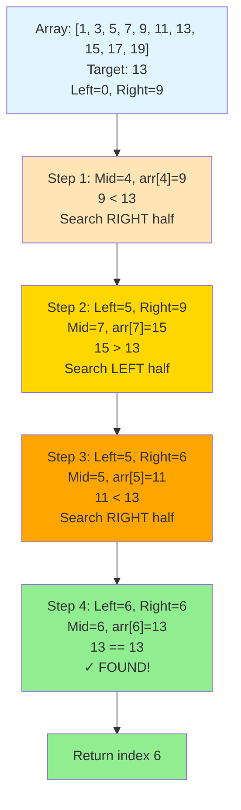
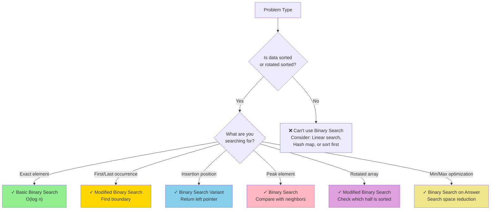
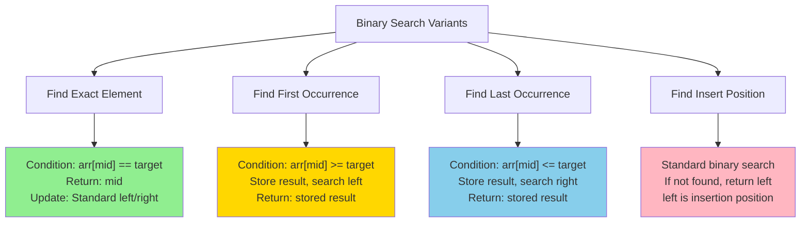
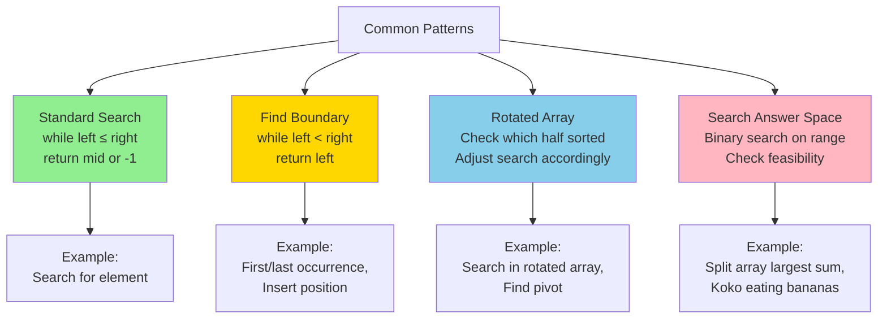
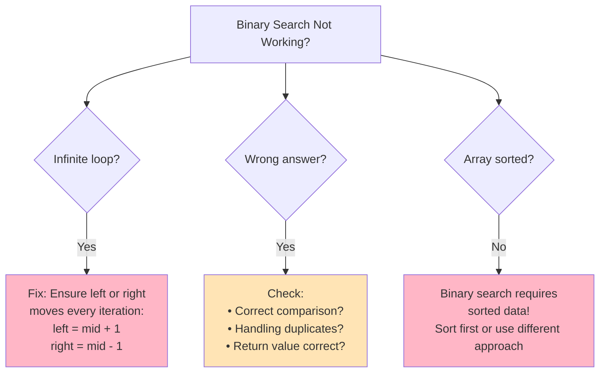
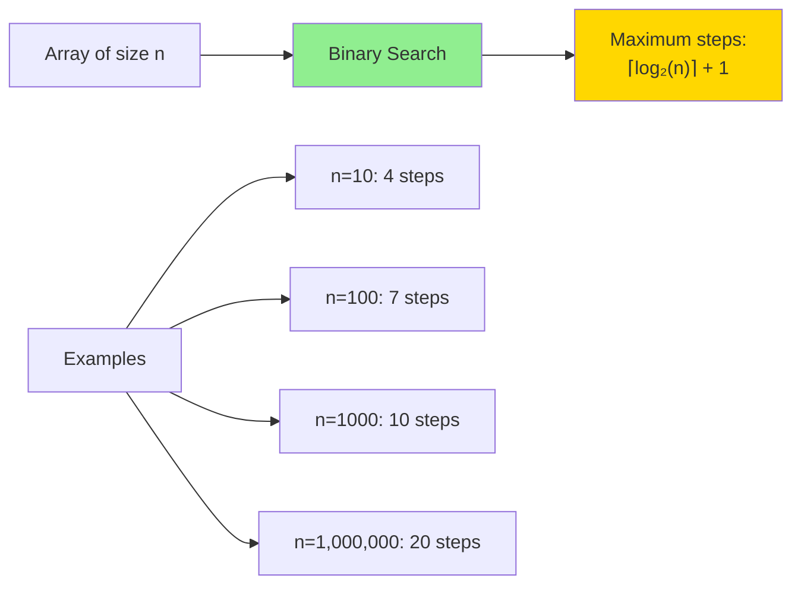

# Binary Search Pattern

Binary Search is an efficient algorithm for finding an element in a sorted array. It works by repeatedly dividing the search interval in half, eliminating half of the remaining elements at each step.

## Visual Representation

### Binary Search Process



### Binary Search Decision Flow

```mermaid
graph TD
    Start[Binary Search] --> Init["Initialize:<br/>left = 0<br/>right = n-1"]
    Init --> Loop{left ≤ right?}

    Loop -->|No| NotFound["Return -1<br/>Element not found"]
    Loop -->|Yes| CalcMid["mid = left + (right-left)/2"]

    CalcMid --> Compare{arr[mid] vs target?}

    Compare -->|Equal| Found["Return mid<br/>Element found!"]
    Compare -->|Less than| GoRight["left = mid + 1<br/>Search right half"]
    Compare -->|Greater than| GoLeft["right = mid - 1<br/>Search left half"]

    GoRight --> Loop
    GoLeft --> Loop

    style Found fill:#90EE90
    style NotFound fill:#FFB6C6
```

## When to Use Binary Search



**Key Indicators:**
- Sorted or monotonic data
- Keywords: "sorted array," "find element," "search"
- Need O(log n) time complexity
- "Minimum value to maximize" or "Maximum value to minimize" (binary search on answer)
- Rotated sorted array problems

## Basic Binary Search Implementation

### Python

```python
def binary_search(arr, target):
    left, right = 0, len(arr) - 1
    
    while left <= right:
        mid = left + (right - left) // 2  # Avoid integer overflow
        
        if arr[mid] == target:
            return mid  # Element found
        elif arr[mid] < target:
            left = mid + 1  # Search in the right half
        else:
            right = mid - 1  # Search in the left half
    
    return -1  # Element not found

# Example usage
arr = [1, 3, 5, 7, 9, 11, 13, 15, 17, 19]
target = 13
print(binary_search(arr, target))  # Output: 6
```

### JavaScript

```javascript
function binarySearch(arr, target) {
    let left = 0;
    let right = arr.length - 1;
    
    while (left <= right) {
        const mid = left + Math.floor((right - left) / 2);  // Avoid integer overflow
        
        if (arr[mid] === target) {
            return mid;  // Element found
        } else if (arr[mid] < target) {
            left = mid + 1;  // Search in the right half
        } else {
            right = mid - 1;  // Search in the left half
        }
    }
    
    return -1;  // Element not found
}

// Example usage
const arr = [1, 3, 5, 7, 9, 11, 13, 15, 17, 19];
const target = 13;
console.log(binarySearch(arr, target));  // Output: 6
```

## Common Binary Search Variations

### 1. Find the First Occurrence of an Element

**Python:**
```python
def find_first_occurrence(arr, target):
    left, right = 0, len(arr) - 1
    result = -1
    
    while left <= right:
        mid = left + (right - left) // 2
        
        if arr[mid] == target:
            result = mid  # Save the result
            right = mid - 1  # Continue searching in the left half
        elif arr[mid] < target:
            left = mid + 1
        else:
            right = mid - 1
    
    return result

# Example usage
arr = [1, 3, 5, 5, 5, 7, 9, 11]
target = 5
print(find_first_occurrence(arr, target))  # Output: 2
```

**JavaScript:**
```javascript
function findFirstOccurrence(arr, target) {
    let left = 0;
    let right = arr.length - 1;
    let result = -1;
    
    while (left <= right) {
        const mid = left + Math.floor((right - left) / 2);
        
        if (arr[mid] === target) {
            result = mid;  // Save the result
            right = mid - 1;  // Continue searching in the left half
        } else if (arr[mid] < target) {
            left = mid + 1;
        } else {
            right = mid - 1;
        }
    }
    
    return result;
}

// Example usage
const arr = [1, 3, 5, 5, 5, 7, 9, 11];
const target = 5;
console.log(findFirstOccurrence(arr, target));  // Output: 2
```

### 2. Find the Last Occurrence of an Element

**Python:**
```python
def find_last_occurrence(arr, target):
    left, right = 0, len(arr) - 1
    result = -1
    
    while left <= right:
        mid = left + (right - left) // 2
        
        if arr[mid] == target:
            result = mid  # Save the result
            left = mid + 1  # Continue searching in the right half
        elif arr[mid] < target:
            left = mid + 1
        else:
            right = mid - 1
    
    return result

# Example usage
arr = [1, 3, 5, 5, 5, 7, 9, 11]
target = 5
print(find_last_occurrence(arr, target))  # Output: 4
```

**JavaScript:**
```javascript
function findLastOccurrence(arr, target) {
    let left = 0;
    let right = arr.length - 1;
    let result = -1;
    
    while (left <= right) {
        const mid = left + Math.floor((right - left) / 2);
        
        if (arr[mid] === target) {
            result = mid;  // Save the result
            left = mid + 1;  // Continue searching in the right half
        } else if (arr[mid] < target) {
            left = mid + 1;
        } else {
            right = mid - 1;
        }
    }
    
    return result;
}

// Example usage
const arr = [1, 3, 5, 5, 5, 7, 9, 11];
const target = 5;
console.log(findLastOccurrence(arr, target));  // Output: 4
```

### 3. Find the Insertion Position

**Python:**
```python
def find_insertion_position(arr, target):
    left, right = 0, len(arr) - 1
    
    while left <= right:
        mid = left + (right - left) // 2
        
        if arr[mid] == target:
            return mid  # Element found
        elif arr[mid] < target:
            left = mid + 1
        else:
            right = mid - 1
    
    return left  # Insertion position

# Example usage
arr = [1, 3, 5, 7, 9]
target = 6
print(find_insertion_position(arr, target))  # Output: 3 (insert between 5 and 7)
```

**JavaScript:**
```javascript
function findInsertionPosition(arr, target) {
    let left = 0;
    let right = arr.length - 1;
    
    while (left <= right) {
        const mid = left + Math.floor((right - left) / 2);
        
        if (arr[mid] === target) {
            return mid;  // Element found
        } else if (arr[mid] < target) {
            left = mid + 1;
        } else {
            right = mid - 1;
        }
    }
    
    return left;  // Insertion position
}

// Example usage
const arr = [1, 3, 5, 7, 9];
const target = 6;
console.log(findInsertionPosition(arr, target));  // Output: 3 (insert between 5 and 7)
```

### 4. Search in a Rotated Sorted Array

**Python:**
```python
def search_rotated_array(arr, target):
    left, right = 0, len(arr) - 1
    
    while left <= right:
        mid = left + (right - left) // 2
        
        if arr[mid] == target:
            return mid  # Element found
        
        # Check if the left half is sorted
        if arr[left] <= arr[mid]:
            # Check if target is in the left half
            if arr[left] <= target < arr[mid]:
                right = mid - 1
            else:
                left = mid + 1
        # Right half is sorted
        else:
            # Check if target is in the right half
            if arr[mid] < target <= arr[right]:
                left = mid + 1
            else:
                right = mid - 1
    
    return -1  # Element not found

# Example usage
arr = [4, 5, 6, 7, 0, 1, 2]
target = 0
print(search_rotated_array(arr, target))  # Output: 4
```

**JavaScript:**
```javascript
function searchRotatedArray(arr, target) {
    let left = 0;
    let right = arr.length - 1;
    
    while (left <= right) {
        const mid = left + Math.floor((right - left) / 2);
        
        if (arr[mid] === target) {
            return mid;  // Element found
        }
        
        // Check if the left half is sorted
        if (arr[left] <= arr[mid]) {
            // Check if target is in the left half
            if (arr[left] <= target && target < arr[mid]) {
                right = mid - 1;
            } else {
                left = mid + 1;
            }
        }
        // Right half is sorted
        else {
            // Check if target is in the right half
            if (arr[mid] < target && target <= arr[right]) {
                left = mid + 1;
            } else {
                right = mid - 1;
            }
        }
    }
    
    return -1;  // Element not found
}

// Example usage
const arr = [4, 5, 6, 7, 0, 1, 2];
const target = 0;
console.log(searchRotatedArray(arr, target));  // Output: 4
```

### 5. Find the Peak Element

**Python:**
```python
def find_peak_element(arr):
    left, right = 0, len(arr) - 1
    
    while left < right:
        mid = left + (right - left) // 2
        
        if arr[mid] > arr[mid + 1]:
            # Peak is in the left half (including mid)
            right = mid
        else:
            # Peak is in the right half
            left = mid + 1
    
    return left  # Peak element index

# Example usage
arr = [1, 3, 4, 3, 5, 6, 4]
print(find_peak_element(arr))  # Output: 5 (value 6)
```

**JavaScript:**
```javascript
function findPeakElement(arr) {
    let left = 0;
    let right = arr.length - 1;
    
    while (left < right) {
        const mid = left + Math.floor((right - left) / 2);
        
        if (arr[mid] > arr[mid + 1]) {
            // Peak is in the left half (including mid)
            right = mid;
        } else {
            // Peak is in the right half
            left = mid + 1;
        }
    }
    
    return left;  // Peak element index
}

// Example usage
const arr = [1, 3, 4, 3, 5, 6, 4];
console.log(findPeakElement(arr));  // Output: 5 (value 6)
```

## Time and Space Complexity

| Algorithm | Time Complexity | Space Complexity |
|-----------|----------------|-----------------|
| Binary Search | O(log n) | O(1) |

## Common Binary Search Problems from Blind 75 and Grind 75

1. **Binary Search** (Easy): Find a target value in a sorted array.
2. **Search in Rotated Sorted Array** (Medium): Search for a target value in a rotated sorted array.
3. **Find First and Last Position of Element in Sorted Array** (Medium): Find the starting and ending position of a given target value.
4. **Search Insert Position** (Easy): Find the index where a target would be inserted in a sorted array.
5. **Find Peak Element** (Medium): Find a peak element in an array.
6. **Find Minimum in Rotated Sorted Array** (Medium): Find the minimum element in a rotated sorted array.
7. **Median of Two Sorted Arrays** (Hard): Find the median of two sorted arrays.
8. **Koko Eating Bananas** (Medium): Find the minimum eating speed to eat all bananas within a given time.

## Tips and Tricks for Binary Search

1. **Use `left + (right - left) // 2` instead of `(left + right) // 2`** to avoid integer overflow.

2. **Be careful with the termination condition**: Use `left <= right` for standard binary search, and `left < right` for some variations.

3. **Handle edge cases**: Empty arrays, single-element arrays, and arrays with duplicate elements.

4. **Be mindful of the search space**: Make sure your search space includes the potential answer.

5. **Check the boundary conditions**: Ensure that your algorithm handles the first and last elements correctly.

6. **Use binary search on the answer space**: Sometimes, you can apply binary search on the answer space rather than the array itself.

7. **Consider the problem constraints**: Binary search is particularly useful when the time complexity requirement is O(log n).

## Common Pitfalls

1. **Off-by-one errors**: Be careful with the indices, especially when updating `left` and `right`.

2. **Infinite loops**: Ensure that the search space is reduced in each iteration.

3. **Not handling duplicates correctly**: When there are duplicates, you might need to modify the standard binary search.

4. **Incorrect mid calculation**: Using `(left + right) / 2` can lead to integer overflow for large arrays.

5. **Wrong termination condition**: Using `left < right` instead of `left <= right` (or vice versa) can lead to incorrect results.

## How to Identify Binary Search Problems

Look for these clues in the problem statement:

1. The input is sorted or partially sorted.
2. You need to find a specific element or the insertion position of an element.
3. The problem asks for an O(log n) solution.
4. The problem involves finding the first/last occurrence, peak element, or minimum/maximum value.
5. The problem involves minimizing the maximum or maximizing the minimum value.
6. Keywords like "sorted," "search," "find," "minimum," "maximum," or "efficient search."

## Binary Search Template

Here's a general template for binary search problems:

```python
def binary_search(arr, target):
    left, right = 0, len(arr) - 1  # Define the search space
    
    while left <= right:  # Continue until the search space is empty
        mid = left + (right - left) // 2  # Calculate the middle index
        
        if condition(mid):  # Check if the middle element satisfies the condition
            # Process the result (e.g., save it, return it)
            # Adjust the search space (e.g., search in the left or right half)
        else:
            # Adjust the search space (e.g., search in the left or right half)
    
    # Return the result or a default value
```

## Real-World Applications

1. **Database Indexing**: Binary search is used in database indexes to quickly locate records.
2. **Compression Algorithms**: Used in various compression algorithms to efficiently search for patterns.
3. **Machine Learning**: Used in algorithms like binary decision trees.
4. **Computer Graphics**: Used in ray tracing and collision detection algorithms.
5. **Network Routing**: Used in routing algorithms to find the shortest path.
6. **Game Development**: Used in pathfinding algorithms and AI decision-making.

## 💡 Tips and Tricks

### Binary Search Variants Quick Reference



### Pro Tips

**1. Avoid Integer Overflow**
```python
# ❌ Bad: Can overflow with large values
mid = (left + right) // 2

# ✓ Good: Safe from overflow
mid = left + (right - left) // 2
```

**2. Choose Correct Loop Condition**
```python
# Use left <= right for exact element search
while left <= right:  # Checks all elements including when left == right

# Use left < right for finding boundaries
while left < right:  # Stops when left meets right
```

**3. Template for Finding First Occurrence**
```python
def find_first(arr, target):
    left, right = 0, len(arr) - 1
    result = -1

    while left <= right:
        mid = left + (right - left) // 2
        if arr[mid] == target:
            result = mid  # Save result
            right = mid - 1  # Continue searching left
        elif arr[mid] < target:
            left = mid + 1
        else:
            right = mid - 1

    return result
```

**4. Template for Finding Last Occurrence**
```python
def find_last(arr, target):
    left, right = 0, len(arr) - 1
    result = -1

    while left <= right:
        mid = left + (right - left) // 2
        if arr[mid] == target:
            result = mid  # Save result
            left = mid + 1  # Continue searching right
        elif arr[mid] < target:
            left = mid + 1
        else:
            right = mid - 1

    return result
```

**5. Binary Search on Answer (Advanced Pattern)**
```python
def binary_search_on_answer(arr, constraint):
    # Define search space based on problem
    left, right = min_possible, max_possible

    while left < right:
        mid = left + (right - left) // 2

        # Check if mid satisfies the constraint
        if is_feasible(mid, arr, constraint):
            right = mid  # Try smaller values (minimize)
        else:
            left = mid + 1

    return left  # Or right, they're equal
```

### Common Patterns Cheatsheet



### Debugging Checklist



### Interview Tips

**1. Clarify Requirements**
- Is array sorted? Ascending or descending?
- Are there duplicates? Need first or last occurrence?
- What to return if not found? -1? Insert position?

**2. Choose Right Template**
- Exact match → `left <= right`
- Find boundary → `left < right`
- Search answer space → `left < right` with feasibility check

**3. Test Edge Cases**
```python
# Always test these:
test_cases = [
    [],              # Empty array
    [1],             # Single element
    [1, 1, 1],       # All duplicates
    [1, 2],          # Two elements
    [1, 2, 3, 4, 5], # No duplicates
]
```

**4. Time & Space Complexity**
- Time: O(log n) - Halving search space each iteration
- Space: O(1) - Only using pointers
- Recursive: O(log n) space for call stack

### Common Mistakes to Avoid

| Mistake | Problem | Solution |
|---------|---------|----------|
| `mid = (left + right) / 2` | Integer overflow | Use `left + (right-left)//2` |
| Wrong loop condition | Missing elements or infinite loop | Match condition to problem type |
| Not updating pointers | Infinite loop | Ensure `left` or `right` changes |
| Comparing with wrong value | Wrong results | Double-check comparison logic |
| Not handling edge cases | Crashes or wrong answers | Test empty, single element, duplicates |

### Binary Search Complexity Guarantee



**Why Binary Search is Powerful:**
- Searches 1 billion elements in ~30 steps!
- Each step eliminates half the remaining elements
- Logarithmic growth means it scales incredibly well 