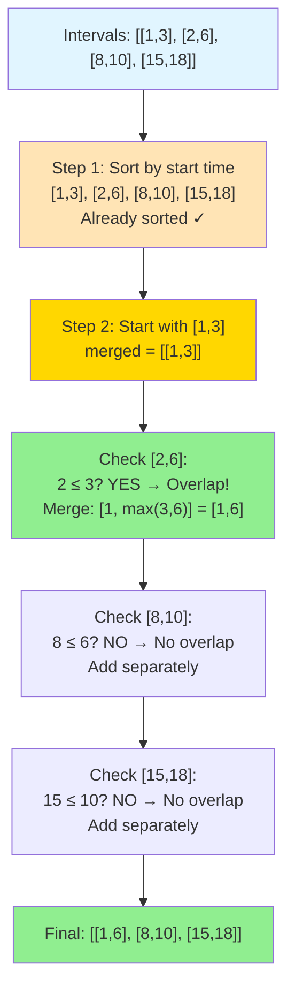
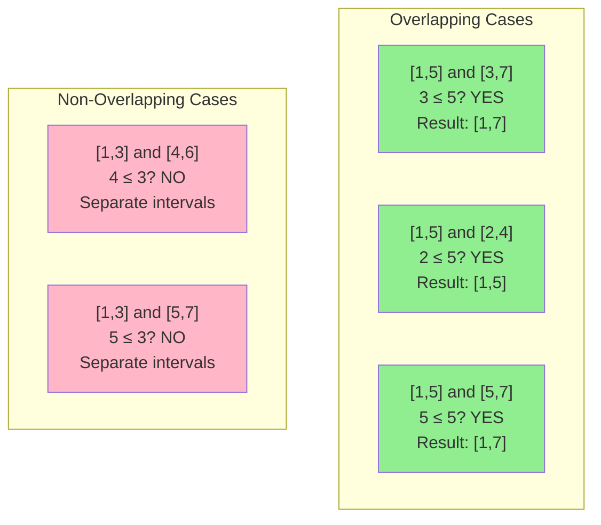
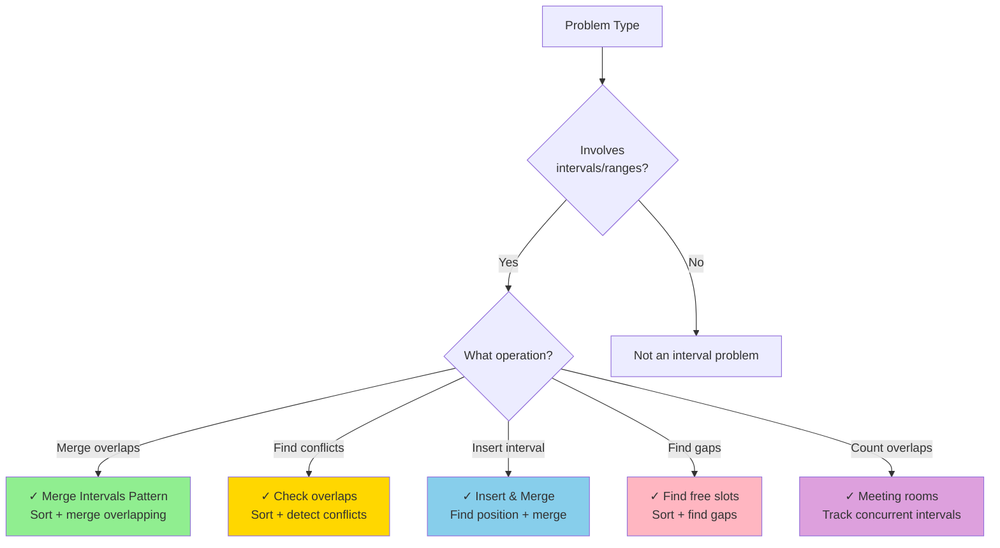
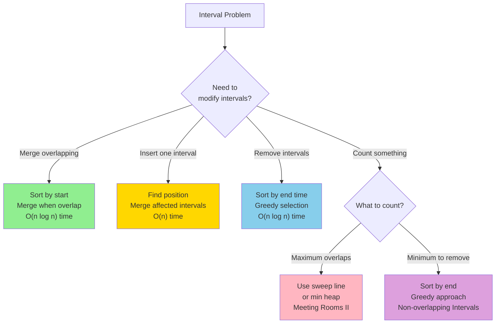
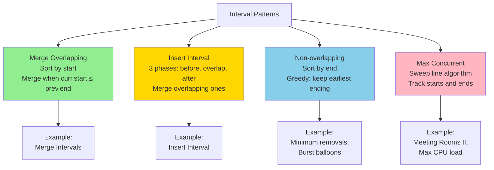
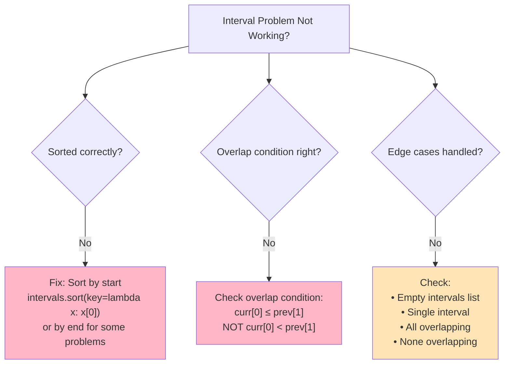
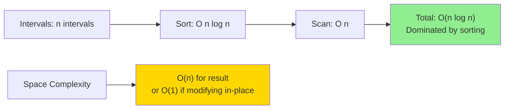

# Merge Intervals Pattern

The Merge Intervals pattern is a technique used to solve problems involving overlapping intervals. It's particularly useful for tasks like merging meetings, finding free time slots, or determining if intervals overlap.

## Visual Representation

### Merge Intervals Process



### Overlap Detection Visual



## When to Use Merge Intervals



**Key Indicators:**
- Time intervals, date ranges, number ranges
- Keywords: "merge," "overlap," "conflict," "schedule," "meeting"
- Need to combine or compare intervals
- Find free time slots or available resources

## Common Problems and Solutions

### 1. Merge Overlapping Intervals

**Problem:** Given a collection of intervals, merge all overlapping intervals.

**Python Solution:**
```python
def merge_intervals(intervals):
    if not intervals:
        return []
    
    # Sort intervals by start time
    intervals.sort(key=lambda x: x[0])
    
    merged = [intervals[0]]
    
    for i in range(1, len(intervals)):
        current = intervals[i]
        previous = merged[-1]
        
        # If current interval overlaps with the previous one, merge them
        if current[0] <= previous[1]:
            # Update the end time of the previous interval if needed
            merged[-1][1] = max(previous[1], current[1])
        else:
            # Add the current interval to the result
            merged.append(current)
    
    return merged

# Example usage
intervals = [[1, 3], [2, 6], [8, 10], [15, 18]]
print(merge_intervals(intervals))  # Output: [[1, 6], [8, 10], [15, 18]]
```

**JavaScript Solution:**
```javascript
function mergeIntervals(intervals) {
    if (!intervals.length) {
        return [];
    }
    
    // Sort intervals by start time
    intervals.sort((a, b) => a[0] - b[0]);
    
    const merged = [intervals[0]];
    
    for (let i = 1; i < intervals.length; i++) {
        const current = intervals[i];
        const previous = merged[merged.length - 1];
        
        // If current interval overlaps with the previous one, merge them
        if (current[0] <= previous[1]) {
            // Update the end time of the previous interval if needed
            previous[1] = Math.max(previous[1], current[1]);
        } else {
            // Add the current interval to the result
            merged.push(current);
        }
    }
    
    return merged;
}

// Example usage
const intervals = [[1, 3], [2, 6], [8, 10], [15, 18]];
console.log(mergeIntervals(intervals));  // Output: [[1, 6], [8, 10], [15, 18]]
```

**Time Complexity:** O(n log n) due to sorting  
**Space Complexity:** O(n) for the output array

### 2. Insert Interval

**Problem:** Given a set of non-overlapping intervals and a new interval, insert the new interval at the correct position and merge if necessary.

**Python Solution:**
```python
def insert_interval(intervals, new_interval):
    result = []
    i = 0
    n = len(intervals)
    
    # Add all intervals that come before the new interval
    while i < n and intervals[i][1] < new_interval[0]:
        result.append(intervals[i])
        i += 1
    
    # Merge overlapping intervals
    while i < n and intervals[i][0] <= new_interval[1]:
        new_interval[0] = min(new_interval[0], intervals[i][0])
        new_interval[1] = max(new_interval[1], intervals[i][1])
        i += 1
    
    # Add the merged interval
    result.append(new_interval)
    
    # Add all intervals that come after the new interval
    while i < n:
        result.append(intervals[i])
        i += 1
    
    return result

# Example usage
intervals = [[1, 3], [6, 9]]
new_interval = [2, 5]
print(insert_interval(intervals, new_interval))  # Output: [[1, 5], [6, 9]]
```

**JavaScript Solution:**
```javascript
function insertInterval(intervals, newInterval) {
    const result = [];
    let i = 0;
    const n = intervals.length;
    
    // Add all intervals that come before the new interval
    while (i < n && intervals[i][1] < newInterval[0]) {
        result.push(intervals[i]);
        i++;
    }
    
    // Merge overlapping intervals
    while (i < n && intervals[i][0] <= newInterval[1]) {
        newInterval[0] = Math.min(newInterval[0], intervals[i][0]);
        newInterval[1] = Math.max(newInterval[1], intervals[i][1]);
        i++;
    }
    
    // Add the merged interval
    result.push(newInterval);
    
    // Add all intervals that come after the new interval
    while (i < n) {
        result.push(intervals[i]);
        i++;
    }
    
    return result;
}

// Example usage
const intervals = [[1, 3], [6, 9]];
const newInterval = [2, 5];
console.log(insertInterval(intervals, newInterval));  // Output: [[1, 5], [6, 9]]
```

**Time Complexity:** O(n)  
**Space Complexity:** O(n) for the output array

### 3. Interval List Intersections

**Problem:** Given two lists of closed intervals, find the intersection of these two lists.

**Python Solution:**
```python
def interval_intersection(A, B):
    result = []
    i, j = 0, 0
    
    while i < len(A) and j < len(B):
        # Find the overlap
        start = max(A[i][0], B[j][0])
        end = min(A[i][1], B[j][1])
        
        # If there is an overlap, add it to the result
        if start <= end:
            result.append([start, end])
        
        # Move the pointer of the interval with the smaller end time
        if A[i][1] < B[j][1]:
            i += 1
        else:
            j += 1
    
    return result

# Example usage
A = [[0, 2], [5, 10], [13, 23], [24, 25]]
B = [[1, 5], [8, 12], [15, 24], [25, 26]]
print(interval_intersection(A, B))  # Output: [[1, 2], [5, 5], [8, 10], [15, 23], [24, 24], [25, 25]]
```

**JavaScript Solution:**
```javascript
function intervalIntersection(A, B) {
    const result = [];
    let i = 0, j = 0;
    
    while (i < A.length && j < B.length) {
        // Find the overlap
        const start = Math.max(A[i][0], B[j][0]);
        const end = Math.min(A[i][1], B[j][1]);
        
        // If there is an overlap, add it to the result
        if (start <= end) {
            result.push([start, end]);
        }
        
        // Move the pointer of the interval with the smaller end time
        if (A[i][1] < B[j][1]) {
            i++;
        } else {
            j++;
        }
    }
    
    return result;
}

// Example usage
const A = [[0, 2], [5, 10], [13, 23], [24, 25]];
const B = [[1, 5], [8, 12], [15, 24], [25, 26]];
console.log(intervalIntersection(A, B));  // Output: [[1, 2], [5, 5], [8, 10], [15, 23], [24, 24], [25, 25]]
```

**Time Complexity:** O(n + m) where n and m are the lengths of the input arrays  
**Space Complexity:** O(n + m) in the worst case for the output array

### 4. Non-overlapping Intervals

**Problem:** Given a collection of intervals, find the minimum number of intervals you need to remove to make the rest of the intervals non-overlapping.

**Python Solution:**
```python
def erase_overlap_intervals(intervals):
    if not intervals:
        return 0
    
    # Sort intervals by end time
    intervals.sort(key=lambda x: x[1])
    
    count = 0
    end = intervals[0][1]
    
    for i in range(1, len(intervals)):
        # If the current interval overlaps with the previous one, remove it
        if intervals[i][0] < end:
            count += 1
        else:
            # Update the end time
            end = intervals[i][1]
    
    return count

# Example usage
intervals = [[1, 2], [2, 3], [3, 4], [1, 3]]
print(erase_overlap_intervals(intervals))  # Output: 1 (remove [1, 3])
```

**JavaScript Solution:**
```javascript
function eraseOverlapIntervals(intervals) {
    if (!intervals.length) {
        return 0;
    }
    
    // Sort intervals by end time
    intervals.sort((a, b) => a[1] - b[1]);
    
    let count = 0;
    let end = intervals[0][1];
    
    for (let i = 1; i < intervals.length; i++) {
        // If the current interval overlaps with the previous one, remove it
        if (intervals[i][0] < end) {
            count++;
        } else {
            // Update the end time
            end = intervals[i][1];
        }
    }
    
    return count;
}

// Example usage
const intervals = [[1, 2], [2, 3], [3, 4], [1, 3]];
console.log(eraseOverlapIntervals(intervals));  // Output: 1 (remove [1, 3])
```

**Time Complexity:** O(n log n) due to sorting  
**Space Complexity:** O(1) if we don't count the input array

### 5. Meeting Rooms II

**Problem:** Given an array of meeting time intervals, find the minimum number of conference rooms required.

**Python Solution:**
```python
import heapq

def min_meeting_rooms(intervals):
    if not intervals:
        return 0
    
    # Sort intervals by start time
    intervals.sort(key=lambda x: x[0])
    
    # Min heap to track end times of meetings
    rooms = []
    heapq.heappush(rooms, intervals[0][1])
    
    for i in range(1, len(intervals)):
        # If the current meeting starts after the earliest ending meeting,
        # we can reuse the same room
        if intervals[i][0] >= rooms[0]:
            heapq.heappop(rooms)
        
        # Add the end time of the current meeting
        heapq.heappush(rooms, intervals[i][1])
    
    # The size of the heap is the number of rooms needed
    return len(rooms)

# Example usage
intervals = [[0, 30], [5, 10], [15, 20]]
print(min_meeting_rooms(intervals))  # Output: 2
```

**JavaScript Solution:**
```javascript
function minMeetingRooms(intervals) {
    if (!intervals.length) {
        return 0;
    }
    
    // Extract start and end times
    const starts = intervals.map(interval => interval[0]).sort((a, b) => a - b);
    const ends = intervals.map(interval => interval[1]).sort((a, b) => a - b);
    
    let rooms = 0;
    let endIndex = 0;
    
    for (let i = 0; i < starts.length; i++) {
        // If the current meeting starts before the earliest ending meeting,
        // we need a new room
        if (starts[i] < ends[endIndex]) {
            rooms++;
        } else {
            // We can reuse a room
            endIndex++;
        }
    }
    
    return rooms;
}

// Example usage
const intervals = [[0, 30], [5, 10], [15, 20]];
console.log(minMeetingRooms(intervals));  // Output: 2
```

**Time Complexity:** O(n log n) due to sorting  
**Space Complexity:** O(n) for the heap or sorted arrays

## Time and Space Complexity

| Algorithm | Time Complexity | Space Complexity |
|-----------|----------------|-----------------|
| Merge Intervals | O(n log n) | O(n) |
| Insert Interval | O(n) | O(n) |
| Interval Intersection | O(n + m) | O(n + m) |
| Non-overlapping Intervals | O(n log n) | O(1) |
| Meeting Rooms II | O(n log n) | O(n) |

## Tips and Tricks for Merge Intervals

1. **Sort First**: Most interval problems require sorting the intervals first, usually by start time or end time.

2. **Choose the Right Sorting Criteria**: Sort by start time when merging intervals, and by end time when selecting non-overlapping intervals.

3. **Check for Overlap**: Two intervals [a, b] and [c, d] overlap if and only if max(a, c) <= min(b, d).

4. **Merge Overlapping Intervals**: When merging [a, b] and [c, d], the result is [min(a, c), max(b, d)].

5. **Use Min Heap for End Times**: When dealing with room allocation or resource scheduling, a min heap of end times is often useful.

6. **Two-Pointer Technique**: For problems involving two lists of intervals, the two-pointer technique is often effective.

7. **Greedy Approach**: Many interval problems can be solved using a greedy approach after sorting.

## Common Pitfalls

1. **Not Sorting Properly**: Forgetting to sort intervals or sorting them by the wrong criteria.

2. **Incorrect Overlap Check**: Misunderstanding when two intervals overlap.

3. **Not Handling Edge Cases**: Forgetting to handle empty input or single-interval cases.

4. **Modifying Input**: Accidentally modifying the input array when it should be preserved.

5. **Inefficient Merging**: Using a nested loop to find overlapping intervals instead of a linear scan after sorting.

## How to Identify Merge Intervals Problems

Look for these clues in the problem statement:

1. The problem involves intervals, ranges, or time periods.
2. The problem asks about overlapping or non-overlapping intervals.
3. The problem requires merging or inserting intervals.
4. The problem involves scheduling or resource allocation.
5. Keywords like "interval," "overlap," "merge," "meeting," or "schedule."

## Common Merge Intervals Problems from Blind 75 and Grind 75

1. **Merge Intervals** (Medium): Merge all overlapping intervals.
2. **Insert Interval** (Medium): Insert a new interval into a set of non-overlapping intervals.
3. **Non-overlapping Intervals** (Medium): Find the minimum number of intervals to remove to make the rest non-overlapping.
4. **Meeting Rooms** (Easy): Determine if a person could attend all meetings.
5. **Meeting Rooms II** (Medium): Find the minimum number of conference rooms required.
6. **Employee Free Time** (Hard): Find the free time slots that are common to all employees.
7. **Interval List Intersections** (Medium): Find the intersection of two lists of intervals.
8. **Minimum Number of Arrows to Burst Balloons** (Medium): Find the minimum number of arrows needed to burst all balloons.

## Merge Intervals Template

Here's a general template for solving merge intervals problems:

```python
def solve_interval_problem(intervals):
    # Sort intervals by start time (or end time, depending on the problem)
    intervals.sort(key=lambda x: x[0])
    
    result = []
    
    # Process intervals one by one
    for interval in intervals:
        # Logic specific to the problem
        # For example, for merging intervals:
        if not result or interval[0] > result[-1][1]:
            result.append(interval)
        else:
            result[-1][1] = max(result[-1][1], interval[1])
    
    return result
```

## Real-World Applications

1. **Calendar Applications**: Scheduling meetings and finding free time slots.
2. **Resource Allocation**: Allocating resources like conference rooms or equipment.
3. **Network Bandwidth Management**: Managing bandwidth allocation over time.
4. **Task Scheduling**: Scheduling tasks with start and end times.
5. **Flight Scheduling**: Managing flight schedules and gate assignments.
6. **Hotel Booking Systems**: Managing room reservations and availability.

## 💡 Tips and Tricks

### Interval Pattern Decision Tree



### Pro Tips

**1. Always Sort First**
```python
# ✓ Essential first step for most interval problems
intervals.sort(key=lambda x: x[0])  # Sort by start
# OR
intervals.sort(key=lambda x: x[1])  # Sort by end (for some problems)
```

**2. Overlap Condition**
```python
# Two intervals [a,b] and [c,d] overlap if:
if c <= b:  # c (start of second) <= b (end of first)
    # They overlap!

# Merge them:
merged = [a, max(b, d)]
```

**3. Common Patterns**
```python
# Pattern 1: Merge all overlapping
def merge(intervals):
    intervals.sort(key=lambda x: x[0])
    merged = [intervals[0]]
    for curr in intervals[1:]:
        if curr[0] <= merged[-1][1]:
            merged[-1][1] = max(merged[-1][1], curr[1])
        else:
            merged.append(curr)
    return merged

# Pattern 2: Count maximum overlaps (Meeting Rooms II)
def min_meeting_rooms(intervals):
    starts = sorted([i[0] for i in intervals])
    ends = sorted([i[1] for i in intervals])
    rooms = max_rooms = 0
    s = e = 0

    while s < len(starts):
        if starts[s] < ends[e]:
            rooms += 1
            max_rooms = max(max_rooms, rooms)
            s += 1
        else:
            rooms -= 1
            e += 1
    return max_rooms
```

**4. Interval Representation**
```python
# Use consistent representation
[start, end]  # Most common
# OR
(start, end)  # Tuple (immutable)
# OR
class Interval:
    def __init__(self, start, end):
        self.start = start
        self.end = end
```

### Common Patterns Cheatsheet



### Debugging Checklist



### Problem-Specific Tricks

**For Merge Intervals:**
- Always sort by start time first
- Use `max()` when updating end time
- Can modify in-place or use new array

**For Meeting Rooms II:**
- Two-pointer technique on sorted starts and ends
- Or use min heap to track ongoing meetings
- Count peaks in overlap graph

**For Non-overlapping Intervals:**
- Sort by end time (greedy)
- Keep interval with earliest end
- Count how many we keep, return total - kept

**For Insert Interval:**
- Three phases: before insertion, during overlap, after insertion
- Merge all overlapping intervals in middle phase

### Complexity Analysis



**Time Complexity: O(n log n)**
- Sorting: O(n log n)
- Scanning: O(n)
- Total dominated by sorting

**Space Complexity:**
- O(n) for result array
- O(1) extra space (not counting result)
- Sorting may use O(log n) stack space

### Interview Tips

**1. Clarify Interval Representation**
- Inclusive or exclusive endpoints?
- `[1,3]` means 1 and 3 included or 1 included, 3 excluded?
- Can intervals have same start/end?

**2. Ask About Edge Cases**
- Empty list of intervals?
- Single interval?
- All intervals identical?
- Intervals already sorted?

**3. Common Interview Mistakes**

| Mistake | Problem | Fix |
|---------|---------|-----|
| Wrong overlap check | `curr[0] < prev[1]` | Use `curr[0] <= prev[1]` |
| Not sorting | Incorrect results | Always sort by start (or end) first |
| Wrong end time | Not taking maximum | Use `max(prev[1], curr[1])` |
| Modifying while iterating | Index errors | Use new array or careful indexing |
| Not handling single interval | Edge case failure | Check `if len(intervals) <= 1` |

**4. Template to Remember**
```python
def interval_problem(intervals):
    if not intervals:
        return []

    # Sort by start (or end, depending on problem)
    intervals.sort(key=lambda x: x[0])

    result = [intervals[0]]  # or appropriate initialization

    for curr in intervals[1:]:
        prev = result[-1]

        # Check overlap
        if curr[0] <= prev[1]:
            # Merge: update prev's end
            prev[1] = max(prev[1], curr[1])
        else:
            # No overlap: add curr
            result.append(curr)

    return result
```

### Visual Debugging Tips

When debugging interval problems, draw them:
```
Timeline visualization:
[1,3]     [8,10]   [15,18]
|--|       |--|     |---|
[2,6]
  |----|

After merge:
[1,6]     [8,10]   [15,18]
|-----|    |--|     |---|
```

This helps visualize overlaps and gaps! 