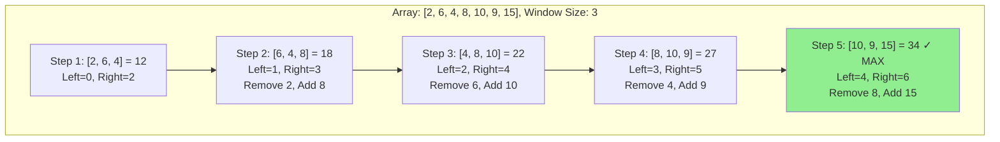
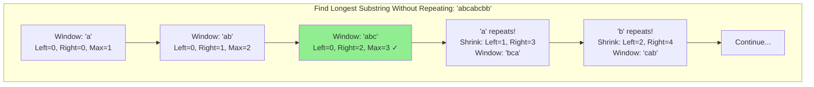
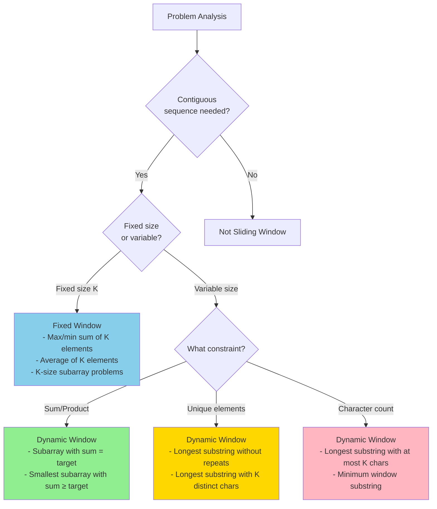
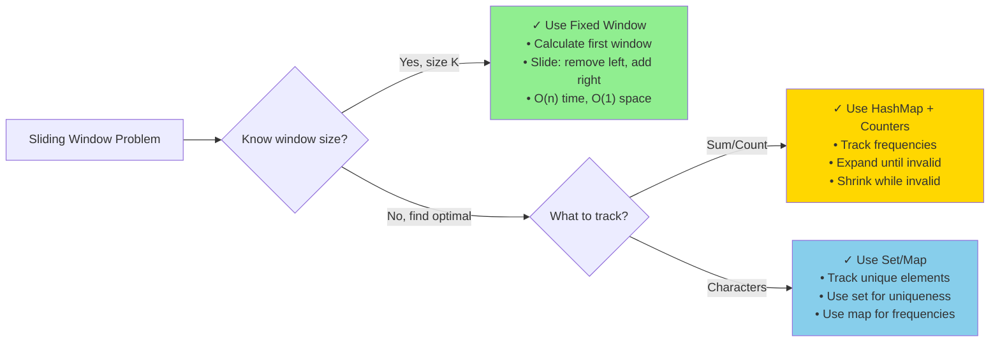
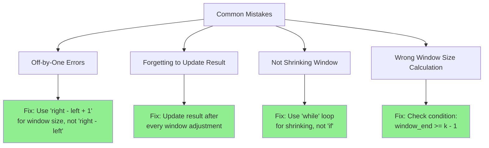
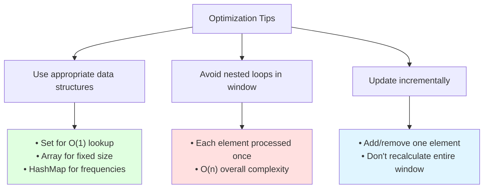

# Sliding Window Pattern

The Sliding Window pattern is a technique used to process arrays or lists in a sequential manner by maintaining a "window" of elements. This window can grow or shrink as needed, and it slides through the data to solve the problem efficiently.

## Visual Representation

### Fixed-Size Sliding Window



### Dynamic-Size Sliding Window



## When to Use Sliding Window



**Key Indicators:**
- Contiguous sequences (subarrays, substrings)
- Find maximum, minimum, or optimal value
- Calculate something among all subarrays of specific size
- "Longest," "shortest," "maximum," "minimum" keywords

## Types of Sliding Windows

### 1. Fixed-Size Window

The window size remains constant throughout the algorithm.

**Pattern Template:**
```python
def fixed_window(arr, k):
    # Initialize window
    window_value = initial_calculation(arr[:k])
    result = window_value

    # Slide window
    for i in range(k, len(arr)):
        # Remove left element, add right element
        window_value = window_value - arr[i-k] + arr[i]
        result = update_result(result, window_value)

    return result
```

### 2. Dynamic-Size Window

The window size can grow or shrink based on certain conditions.

**Pattern Template:**
```python
def dynamic_window(arr, condition):
    left = 0
    window_state = initial_state()
    result = initial_result()

    for right in range(len(arr)):
        # Expand window
        add_to_window(arr[right], window_state)

        # Shrink window while condition violated
        while not condition_met(window_state):
            remove_from_window(arr[left], window_state)
            left += 1

        # Update result
        result = update_result(result, window_state)

    return result
```

## Common Problems and Solutions

### 1. Maximum Sum Subarray of Size K (Fixed Window)

**Problem:** Find the maximum sum of any contiguous subarray of size k.

**Python Solution:**
```python
def max_sum_subarray(arr, k):
    n = len(arr)
    if n < k:
        return None
    
    # Compute sum of first window
    window_sum = sum(arr[:k])
    max_sum = window_sum
    
    # Slide the window and update the maximum sum
    for i in range(k, n):
        # Add the next element and remove the first element of the previous window
        window_sum = window_sum + arr[i] - arr[i - k]
        max_sum = max(max_sum, window_sum)
    
    return max_sum

# Example usage
arr = [2, 1, 5, 1, 3, 2]
k = 3
print(max_sum_subarray(arr, k))  # Output: 9 (subarray [5, 1, 3])
```

**JavaScript Solution:**
```javascript
function maxSumSubarray(arr, k) {
    const n = arr.length;
    if (n < k) {
        return null;
    }
    
    // Compute sum of first window
    let windowSum = 0;
    for (let i = 0; i < k; i++) {
        windowSum += arr[i];
    }
    
    let maxSum = windowSum;
    
    // Slide the window and update the maximum sum
    for (let i = k; i < n; i++) {
        // Add the next element and remove the first element of the previous window
        windowSum = windowSum + arr[i] - arr[i - k];
        maxSum = Math.max(maxSum, windowSum);
    }
    
    return maxSum;
}

// Example usage
const arr = [2, 1, 5, 1, 3, 2];
const k = 3;
console.log(maxSumSubarray(arr, k));  // Output: 9 (subarray [5, 1, 3])
```

**Time Complexity:** O(n)  
**Space Complexity:** O(1)

### 2. Longest Substring with K Distinct Characters (Dynamic Window)

**Problem:** Find the length of the longest substring with at most k distinct characters.

**Python Solution:**
```python
def longest_substring_with_k_distinct(s, k):
    if not s or k == 0:
        return 0
    
    char_count = {}
    max_length = 0
    window_start = 0
    
    for window_end in range(len(s)):
        right_char = s[window_end]
        
        # Add the current character to the hash map
        char_count[right_char] = char_count.get(right_char, 0) + 1
        
        # Shrink the window if we have more than k distinct characters
        while len(char_count) > k:
            left_char = s[window_start]
            char_count[left_char] -= 1
            if char_count[left_char] == 0:
                del char_count[left_char]
            window_start += 1
        
        # Update the maximum length
        max_length = max(max_length, window_end - window_start + 1)
    
    return max_length

# Example usage
s = "araaci"
k = 2
print(longest_substring_with_k_distinct(s, k))  # Output: 4 (substring "araa")
```

**JavaScript Solution:**
```javascript
function longestSubstringWithKDistinct(s, k) {
    if (!s || k === 0) {
        return 0;
    }
    
    const charCount = new Map();
    let maxLength = 0;
    let windowStart = 0;
    
    for (let windowEnd = 0; windowEnd < s.length; windowEnd++) {
        const rightChar = s[windowEnd];
        
        // Add the current character to the map
        charCount.set(rightChar, (charCount.get(rightChar) || 0) + 1);
        
        // Shrink the window if we have more than k distinct characters
        while (charCount.size > k) {
            const leftChar = s[windowStart];
            charCount.set(leftChar, charCount.get(leftChar) - 1);
            if (charCount.get(leftChar) === 0) {
                charCount.delete(leftChar);
            }
            windowStart++;
        }
        
        // Update the maximum length
        maxLength = Math.max(maxLength, windowEnd - windowStart + 1);
    }
    
    return maxLength;
}

// Example usage
const s = "araaci";
const k = 2;
console.log(longestSubstringWithKDistinct(s, k));  // Output: 4 (substring "araa")
```

**Time Complexity:** O(n)  
**Space Complexity:** O(k)

### 3. Minimum Size Subarray Sum (Dynamic Window)

**Problem:** Find the minimum length of a contiguous subarray with a sum greater than or equal to a given value.

**Python Solution:**
```python
def min_subarray_sum(arr, target):
    n = len(arr)
    window_sum = 0
    min_length = float('inf')
    window_start = 0
    
    for window_end in range(n):
        window_sum += arr[window_end]
        
        # Shrink the window as small as possible while maintaining the sum >= target
        while window_sum >= target:
            min_length = min(min_length, window_end - window_start + 1)
            window_sum -= arr[window_start]
            window_start += 1
    
    return min_length if min_length != float('inf') else 0

# Example usage
arr = [2, 1, 5, 2, 3, 2]
target = 7
print(min_subarray_sum(arr, target))  # Output: 2 (subarray [5, 2])
```

**JavaScript Solution:**
```javascript
function minSubarraySum(arr, target) {
    const n = arr.length;
    let windowSum = 0;
    let minLength = Infinity;
    let windowStart = 0;
    
    for (let windowEnd = 0; windowEnd < n; windowEnd++) {
        windowSum += arr[windowEnd];
        
        // Shrink the window as small as possible while maintaining the sum >= target
        while (windowSum >= target) {
            minLength = Math.min(minLength, windowEnd - windowStart + 1);
            windowSum -= arr[windowStart];
            windowStart++;
        }
    }
    
    return minLength === Infinity ? 0 : minLength;
}

// Example usage
const arr = [2, 1, 5, 2, 3, 2];
const target = 7;
console.log(minSubarraySum(arr, target));  // Output: 2 (subarray [5, 2])
```

**Time Complexity:** O(n)  
**Space Complexity:** O(1)

### 4. Longest Substring Without Repeating Characters (Dynamic Window)

**Problem:** Find the length of the longest substring without repeating characters.

**Python Solution:**
```python
def length_of_longest_substring(s):
    char_index_map = {}
    max_length = 0
    window_start = 0
    
    for window_end in range(len(s)):
        right_char = s[window_end]
        
        # If the character is already in the window, update the window start
        if right_char in char_index_map:
            # Move the window start to the right of the last occurrence of the character
            window_start = max(window_start, char_index_map[right_char] + 1)
        
        # Update the character's index
        char_index_map[right_char] = window_end
        
        # Update the maximum length
        max_length = max(max_length, window_end - window_start + 1)
    
    return max_length

# Example usage
s = "abcabcbb"
print(length_of_longest_substring(s))  # Output: 3 (substring "abc")
```

**JavaScript Solution:**
```javascript
function lengthOfLongestSubstring(s) {
    const charIndexMap = new Map();
    let maxLength = 0;
    let windowStart = 0;
    
    for (let windowEnd = 0; windowEnd < s.length; windowEnd++) {
        const rightChar = s[windowEnd];
        
        // If the character is already in the window, update the window start
        if (charIndexMap.has(rightChar)) {
            // Move the window start to the right of the last occurrence of the character
            windowStart = Math.max(windowStart, charIndexMap.get(rightChar) + 1);
        }
        
        // Update the character's index
        charIndexMap.set(rightChar, windowEnd);
        
        // Update the maximum length
        maxLength = Math.max(maxLength, windowEnd - windowStart + 1);
    }
    
    return maxLength;
}

// Example usage
const s = "abcabcbb";
console.log(lengthOfLongestSubstring(s));  // Output: 3 (substring "abc")
```

**Time Complexity:** O(n)  
**Space Complexity:** O(min(n, m)) where m is the size of the character set

### 5. Find All Anagrams in a String (Fixed Window)

**Problem:** Find all the start indices of anagrams of a pattern in a string.

**Python Solution:**
```python
def find_anagrams(s, p):
    if len(p) > len(s):
        return []
    
    p_count = {}
    s_count = {}
    
    # Initialize the frequency counters
    for char in p:
        p_count[char] = p_count.get(char, 0) + 1
    
    result = []
    window_start = 0
    
    for window_end in range(len(s)):
        # Add the current character to the window
        right_char = s[window_end]
        s_count[right_char] = s_count.get(right_char, 0) + 1
        
        # If the window size is equal to the pattern length
        if window_end >= len(p) - 1:
            # Check if the current window is an anagram
            if s_count == p_count:
                result.append(window_start)
            
            # Remove the leftmost character from the window
            left_char = s[window_start]
            s_count[left_char] -= 1
            if s_count[left_char] == 0:
                del s_count[left_char]
            
            window_start += 1
    
    return result

# Example usage
s = "cbaebabacd"
p = "abc"
print(find_anagrams(s, p))  # Output: [0, 6] (anagrams "cba" and "bac")
```

**JavaScript Solution:**
```javascript
function findAnagrams(s, p) {
    if (p.length > s.length) {
        return [];
    }
    
    const pCount = new Map();
    const sCount = new Map();
    
    // Initialize the frequency counters
    for (const char of p) {
        pCount.set(char, (pCount.get(char) || 0) + 1);
    }
    
    const result = [];
    let windowStart = 0;
    
    for (let windowEnd = 0; windowEnd < s.length; windowEnd++) {
        // Add the current character to the window
        const rightChar = s[windowEnd];
        sCount.set(rightChar, (sCount.get(rightChar) || 0) + 1);
        
        // If the window size is equal to the pattern length
        if (windowEnd >= p.length - 1) {
            // Check if the current window is an anagram
            let isAnagram = true;
            for (const [char, count] of pCount) {
                if (sCount.get(char) !== count) {
                    isAnagram = false;
                    break;
                }
            }
            
            if (isAnagram && pCount.size === sCount.size) {
                result.push(windowStart);
            }
            
            // Remove the leftmost character from the window
            const leftChar = s[windowStart];
            sCount.set(leftChar, sCount.get(leftChar) - 1);
            if (sCount.get(leftChar) === 0) {
                sCount.delete(leftChar);
            }
            
            windowStart++;
        }
    }
    
    return result;
}

// Example usage
const s = "cbaebabacd";
const p = "abc";
console.log(findAnagrams(s, p));  // Output: [0, 6] (anagrams "cba" and "bac")
```

**Time Complexity:** O(n)  
**Space Complexity:** O(k) where k is the size of the character set

## Time and Space Complexity

| Algorithm | Time Complexity | Space Complexity |
|-----------|----------------|-----------------|
| Fixed Window | O(n) | O(1) |
| Dynamic Window | O(n) | O(k) |

## Tips and Tricks for Sliding Window

1. **Identify the Window**: Determine what constitutes a "window" in the problem. It could be a subarray, substring, or any contiguous sequence.

2. **Fixed vs. Dynamic**: Decide whether you need a fixed-size window or a dynamic-size window based on the problem requirements.

3. **Window Expansion**: For each iteration, expand the window by including the next element.

4. **Window Contraction**: For dynamic windows, define the condition for shrinking the window.

5. **Optimization**: Keep track of the window's state efficiently. For example, use a hash map to store character frequencies instead of recounting them.

6. **Edge Cases**: Handle edge cases such as empty arrays or strings, or when the window size is larger than the array.

7. **Sliding, Not Recomputing**: Avoid recomputing values for the entire window. Instead, update the window's state incrementally as it slides.

## Common Pitfalls

1. **Off-by-One Errors**: Be careful with the window boundaries, especially when calculating the window size.

2. **Inefficient Window Updates**: Avoid recalculating the entire window's state when sliding. Instead, update it incrementally.

3. **Incorrect Window Contraction**: Ensure that the window is contracted correctly, especially in dynamic window problems.

4. **Not Handling Edge Cases**: Remember to handle edge cases such as empty arrays or strings.

5. **Forgetting to Update the Result**: Make sure to update the result (e.g., maximum length, minimum sum) after each window operation.

## How to Identify Sliding Window Problems

Look for these clues in the problem statement:

1. The problem involves a linear data structure like an array or string.
2. The problem asks for a contiguous subarray or substring that meets certain conditions.
3. The problem involves finding the maximum, minimum, or optimal value of something in a subarray or substring.
4. The problem mentions a "window" or a "subarray of size k."
5. Keywords like "contiguous," "subarray," "substring," or "consecutive elements."

## Common Sliding Window Problems from Blind 75 and Grind 75

1. **Longest Substring Without Repeating Characters** (Medium): Find the length of the longest substring without repeating characters.
2. **Minimum Size Subarray Sum** (Medium): Find the minimum length of a contiguous subarray with a sum greater than or equal to a given value.
3. **Sliding Window Maximum** (Hard): Find the maximum element in each sliding window of size k.
4. **Longest Repeating Character Replacement** (Medium): Find the length of the longest substring containing the same letter after replacing at most k characters.
5. **Permutation in String** (Medium): Check if a string contains a permutation of another string.
6. **Find All Anagrams in a String** (Medium): Find all the start indices of anagrams of a pattern in a string.
7. **Fruit Into Baskets** (Medium): Find the length of the longest subarray with at most two distinct elements.
8. **Subarrays with K Different Integers** (Hard): Count the number of subarrays with exactly k different integers.

## Sliding Window Template

Here's a general template for solving sliding window problems:

```python
def sliding_window(arr):
    window_start = 0
    result = 0  # or any other initial value based on the problem
    
    for window_end in range(len(arr)):
        # Expand the window by including the element at window_end
        # Update any variables or data structures as needed
        
        # For dynamic window: check if we need to shrink the window
        while condition_to_shrink_window:
            # Update any variables or data structures as needed
            # Shrink the window by moving window_start
            window_start += 1
        
        # Update the result based on the current window
        result = update_result(result, current_window)
    
    return result
```

## Real-World Applications

1. **Network Packet Analysis**: Analyzing network traffic over a sliding window of time.
2. **Stock Market Analysis**: Calculating moving averages or other metrics over a sliding window of stock prices.
3. **Image Processing**: Applying filters or convolutions to images using a sliding window.
4. **Natural Language Processing**: Analyzing text using n-grams or other sliding window techniques.
5. **Anomaly Detection**: Detecting anomalies in time series data using a sliding window approach.
6. **Rate Limiting**: Implementing rate limiting algorithms using a sliding window to track requests over time.

## 💡 Tips and Tricks

### Quick Decision Matrix



### Pro Tips

**1. Always Think Incremental**
```python
# ❌ Bad: Recalculating entire window
window_sum = sum(arr[left:right+1])

# ✓ Good: Incremental update
window_sum = window_sum - arr[left] + arr[right]
```

**2. Use Hash Maps for Character/Element Tracking**
```python
# Track frequencies for anagram problems
char_count = {}  # or defaultdict(int)
char_count[char] = char_count.get(char, 0) + 1
```

**3. Two Conditions for Window Validity**
- **Expand condition**: When can we add to window?
- **Shrink condition**: When must we remove from window?

**4. Track Both Current and Best**
```python
max_length = 0  # Best seen so far
current_length = right - left + 1  # Current window
max_length = max(max_length, current_length)
```

**5. Handle Edge Cases First**
```python
if not arr or k <= 0:
    return []  # or appropriate default
```

### Common Mistakes to Avoid



### Problem-Specific Tricks

**For "Longest" Problems:**
- Use maximum to track best result
- Expand aggressively, shrink minimally
- Often use sets or maps to track uniqueness

**For "Shortest" Problems:**
- Use minimum to track best result
- Shrink aggressively once condition met
- Often involves sum or count thresholds

**For "All Subarrays" Problems:**
- May need to check at every position
- Result often accumulates counts
- Consider number of valid windows ending at each position

### Performance Optimization



### Complexity Analysis Rules

- **Time Complexity**: O(n) where n = array/string length
  - Each element added once, removed once
  - Even with while loop for shrinking, total O(2n) = O(n)

- **Space Complexity**:
  - Fixed window: O(1)
  - Dynamic with char tracking: O(k) where k = unique characters
  - With all elements: O(n) worst case

### Interview Tips

1. **Clarify the problem**: Fixed or dynamic window?
2. **Identify the condition**: What makes a window valid/invalid?
3. **Choose data structure**: Array sum? Use variable. Characters? Use HashMap.
4. **Code the template**: Start with expand, add shrink if needed
5. **Test edge cases**: Empty input, single element, all same elements 